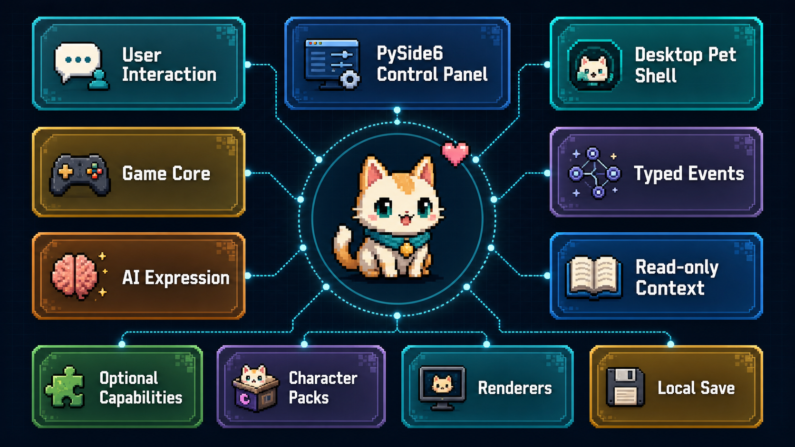

# E-Moti

[中文](#中文说明) | [English](#english-version)

E-Moti is a Windows-first desktop AI companion pet demo built with Python and PySide6. It combines a lightweight virtual-pet loop, switchable character packs, and optional AI expression services. The game state is controlled by local rules; AI is used to make the companion speak, react, and perform with more personality.

The current art-production route is a **hatch-pet-style pixel-pet sequence workflow**: lock one canonical character base, generate and review one animation row at a time, inspect contact sheets, repair failed rows, and only then promote a validated pack into the runtime.

The bundled course-delivery role set includes **three visible switchable character packs**: `xingxi_pixel_pet`, `ikaros_pixel_pet`, and `nairong_pixel_pet`. Xingxi is the default companion. Ikaros and Nairong demonstrate the same character-pack, renderer, memory namespace, shop theme, and voice-profile contracts across different role styles.

> Learning, resting, comforting, and playing are action states. E-Moti is not a productivity coach, course supervisor, mascot skin, or chatbot-only shell.

---

## 中文说明


### 项目定位

E-Moti 是一个 Windows 桌面 AI 电子宠物 Demo。它的核心体验不是“让 AI 接管游戏”，而是把传统桌宠的常驻陪伴、轻量养成、即时反馈和 AI 角色表演结合起来：

- 本地规则负责状态、资源、背包、关系、回忆和存档。
- AI 负责让角色更会说、更会演，可以生成台词、表情提示、动作提示和只读互动意图。
- 屏幕观察、联网搜索、TTS、ASR 都是可选能力，只作为表达与陪伴增强，不拥有养成状态。

### 当前功能

- 控制面板：状态、互动、商店、背包、关系、回忆、对话和设置。
- 桌宠模式：透明置顶窗口、轻量交互、桌面常驻演出。
- 系统托盘：隐藏、恢复、进入桌宠模式和退出。
- 三角色切换：`xingxi_pixel_pet`、`ikaros_pixel_pet`、`nairong_pixel_pet` 可在同一运行时切换。
- 本地养成闭环：心情、信任、金币、等级、背包、关系解锁和长期记忆。
- 角色包系统：每个角色拥有独立的美术资源、角色设定、商店主题、语音画像元数据和存档命名空间。
- 像素宠序列帧路线：使用可验证的 spritesheet、motion manifest、contact sheet、provenance 和 QA 报告。
- AI 表达层：LLM 输出经过 typed events 校验后，才能进入 UI、动作和语音链路。
- 只读感知增强：屏幕摘要、联网搜索和主动话题可注入 expression context，但不能写入游戏状态。
- 语音能力：TTS 只消费已校验的角色 speech；ASR 只生成玩家输入文本，并通过 `DialogueRequest` 进入对话。
- 打包交付：提供 Windows frozen app、Inno Setup installer 和课程便携包构建脚本。

### 架构设计

E-Moti 按“本地规则核心 + AI 表演层 + 可插拔角色包”组织：

| 层 | 主要模块 | 职责 |
| --- | --- | --- |
| UI 与桌面外壳 | `app.py`, `capability_panels.py`, `desktop_shell.py`, `tray_controller.py` | 控制面板、桌宠窗口、托盘生命周期、设置入口 |
| 游戏核心 | `controller.py`, `engine.py`, `actions.py`, `models.py`, `storage.py` | 状态机、互动效果、金币/背包/等级、存档 |
| 角色与内容 | `character_pack.py`, `character_registry.py`, `character_session.py`, `character_resources.py` | 加载角色包、切换角色、隔离角色资源和会话数据 |
| AI 表达管线 | `expression_event_pipeline.py`, `ai_expressor.py`, `expression_parser.py`, `visual_actions.py`, `interaction_intents.py` | 将 LLM 响应解析成 typed events、speech、表情动作和只读意图 |
| 只读上下文 | `expression_context.py`, `ai_context_builder.py`, `screen_observation.py`, `web_search.py`, `topic_scout.py`, `proactive_companion.py` | 屏幕摘要、搜索卡片、主动话题和近期上下文 |
| 语音能力 | `voice_tts.py`, `voice_asr.py`, `voice_service_control.py`, `character_voice_profile.py` | 角色音色配置、TTS 播放、ASR 转写、服务检测 |
| 渲染器 | `presentation_renderer.py`, `snapshot_renderer.py`, `spirit_stage.py`, `live2d_web.py` | sprite 基线渲染、portrait/spirit 研究路径、Live2D Web 适配路径 |
| 工具与验证 | `tools/`, `tests/`, `packaging/` | 角色包验证、像素美术 QA、LLM smoke、Windows 打包和回归测试 |

关键边界：

- LLM 不能修改成长状态、背包、关系、回忆、目标、金币或存档。
- 屏幕观察和联网搜索只产生只读上下文。
- ASR 只能产生玩家输入文本。
- TTS 只能播放通过 typed events 校验后的角色台词。
- sprite renderer 是当前稳定基线；portrait、AI-video、LivePortrait 和 Live2D 是后续研究/扩展路线。

### 角色包结构

运行时角色包位于 `assets/companion/`：

```text
assets/companion/<character_id>/
  character.json
  dialogue_style.json
  motion_manifest.json
  spritesheet.png
  preview/contact-sheet.png
  preview/profile.png
  provenance.md
  qa_report.json
  shop_items.json
  LICENSE.md
```

当前内置角色：

- `xingxi_pixel_pet`: 默认原创主角色。
- `ikaros_pixel_pet`: 用于展示人形角色包、角色切换和语音画像工作流。
- `nairong_pixel_pet`: 用于展示宠物向、搞笑向角色包的兼容性。
- `original_oc`: 旧版兼容资源，保留用于历史 renderer 覆盖。

第三方或二创角色包应保留来源说明、生成记录、QA 证据和授权边界；公开分发前请确认你拥有对应权利。

### 快速开始

环境要求：

- Python 3.11+
- Windows 10/11
- PowerShell
- Inno Setup 6，仅在需要构建安装器时使用

安装开发环境：

```powershell
python -m venv .venv
.\.venv\Scripts\Activate.ps1
python -m pip install -U pip
python -m pip install -e .
python -m pip install pytest pyinstaller
```

启动控制面板：

```powershell
python -m guanghe_companion.app
```

启动桌宠模式：

```powershell
python -m guanghe_companion.app --pet-mode
```

使用演示存档：

```powershell
python -m guanghe_companion.app --demo-save
```

### 测试与验证

```powershell
python -m pytest
python -m pytest tests\test_app.py tests\test_desktop_pet_smoke.py -q
python -m pytest tests\test_repository_hygiene.py -q
python -m json.tool assets\companion\xingxi_pixel_pet\shop_items.json
python -m json.tool assets\companion\ikaros_pixel_pet\shop_items.json
python -m json.tool assets\companion\nairong_pixel_pet\shop_items.json
```

角色包验证：

```powershell
python tools\validate_character_pack.py assets\companion\xingxi_pixel_pet
python tools\validate_character_pack.py assets\companion\ikaros_pixel_pet
python tools\validate_character_pack.py assets\companion\nairong_pixel_pet
python tools\validate_pixel_pet_pack.py assets\companion\xingxi_pixel_pet
```

LLM 表达 smoke：

```powershell
python tools\llm_provider_matrix.py --dry-run --report artifacts\llm_smoke\provider-matrix-dry-run.json --markdown artifacts\llm_smoke\provider-matrix-dry-run.md
$env:DEEPSEEK_API_KEY="<your-local-key>"
python tools\llm_expression_cue_probe.py --provider deepseek --timeout-seconds 45 --min-speech-chars 8 --max-speech-chars 80 --report artifacts\llm_smoke\deepseek-expression-cue-probe.json
Remove-Item Env:\DEEPSEEK_API_KEY
```

Windows 构建：

```powershell
powershell -ExecutionPolicy Bypass -File tools\build_windows_app.ps1
powershell -ExecutionPolicy Bypass -File tools\build_windows_installer.ps1 -SkipAppBuild
python tools\validate_windows_build.py --report artifacts\windows-build-validation.json
```

更多演示与交付操作见 `docs\demo_operator_quickstart.md`、`docs\final_release_gate_2026-07.md` 和 `docs\llm_expression_operations.md`。

### 可选 AI 能力

E-Moti 可以离线运行；AI 能力需要用户在设置中自行配置：

- LLM expression: OpenAI Responses、DeepSeek、OpenRouter、Ollama、LM Studio 或其他 OpenAI-compatible 服务。
- Screen observation: OpenAI-compatible vision endpoint。
- Web search: DuckDuckGo search through `ddgs`。
- TTS: Windows SAPI、Edge TTS 或本地 HTTP TTS 服务。
- ASR: OpenAI-compatible transcription endpoint 或本地 Vosk 模型。

开源仓库不包含 API key、运行时对话历史、私有配置、第三方模型权重或本地存档。

---

## English Version



### What Is E-Moti?

E-Moti is a Windows-first desktop AI companion pet demo. It is designed as a playable virtual-pet loop with desktop presence, lightweight progression, character feedback, and optional AI expression.

The core design rule is simple:

- Local game rules own progression, inventory, memories, relationships, goals, coins, and saves.
- AI improves the companion's speech, expression, motion cues, and read-only context use.
- Optional perception, search, voice, and ASR features enhance presentation but never take over the growth state machine.

### Features

- PySide6 control panel with status, actions, shop, inventory, relationship, memory, dialogue, and settings views.
- Transparent always-on-top desktop pet mode.
- Tray lifecycle: hide, restore, enter pet mode, and exit.
- Character library with three visible bundled packs: `xingxi_pixel_pet`, `ikaros_pixel_pet`, and `nairong_pixel_pet`.
- Local virtual-pet progression for mood, trust, coins, level, inventory, relationship unlocks, and long-term memory.
- Sprite renderer as the stable desktop-pet baseline.
- Pixel-pet sequence workflow with spritesheets, motion manifests, contact sheets, provenance notes, and QA reports.
- Optional LLM expression adapter for validated speech, visual actions, motion cues, and read-only interaction intents.
- Optional screen observation, web search, TTS, and ASR integrations behind explicit settings.
- Windows build and installer scripts.

### Architecture

E-Moti is organized as a local game core plus an AI performance layer and pluggable character packs.

| Layer | Modules | Responsibility |
| --- | --- | --- |
| UI and Shell | `app.py`, `capability_panels.py`, `desktop_shell.py`, `tray_controller.py` | Control panel, desktop pet window, tray lifecycle, capability settings |
| Game Core | `controller.py`, `engine.py`, `actions.py`, `models.py`, `storage.py` | State machine, interaction effects, inventory, coins, level, saves |
| Character System | `character_pack.py`, `character_registry.py`, `character_session.py`, `character_resources.py` | Load, validate, switch, and isolate character packs |
| AI Expression Pipeline | `expression_event_pipeline.py`, `ai_expressor.py`, `expression_parser.py`, `visual_actions.py`, `interaction_intents.py` | Parse LLM output into typed events, speech, visual actions, and read-only intents |
| Read-only Context | `expression_context.py`, `ai_context_builder.py`, `screen_observation.py`, `web_search.py`, `topic_scout.py`, `proactive_companion.py` | Screen summaries, search cards, proactive topics, and recent context |
| Voice | `voice_tts.py`, `voice_asr.py`, `voice_service_control.py`, `character_voice_profile.py` | Character voice profiles, TTS playback, ASR transcription, service checks |
| Renderers | `presentation_renderer.py`, `snapshot_renderer.py`, `spirit_stage.py`, `live2d_web.py` | Sprite baseline, portrait/spirit research path, Live2D Web adapter path |
| Tooling and QA | `tools/`, `tests/`, `packaging/` | Character-pack validation, pixel-art QA, LLM smoke tests, Windows packaging |

Important boundaries:

- LLM output cannot mutate growth state, inventory, relationship, memory, goals, coins, or saves.
- Screen observation and web search only provide read-only expression context.
- ASR only becomes player text through `DialogueRequest`.
- TTS only consumes validated companion speech.
- Sprite rendering is the current production baseline; portrait, AI-video, LivePortrait, and Live2D remain research or extension paths.

### Character Packs

Runtime character packs live under `assets/companion/`.

```text
assets/companion/<character_id>/
  character.json
  dialogue_style.json
  motion_manifest.json
  spritesheet.png
  preview/contact-sheet.png
  preview/profile.png
  provenance.md
  qa_report.json
  shop_items.json
  LICENSE.md
```

Bundled packs:

- `xingxi_pixel_pet`: default original companion.
- `ikaros_pixel_pet`: humanoid character-pack workflow representative.
- `nairong_pixel_pet`: pet-style and goofy character-pack workflow representative.
- `original_oc`: older compatibility assets retained for renderer coverage.

Fanwork or third-party-inspired packs should keep source notes, generation records, QA evidence, and license boundaries. Confirm rights before public redistribution.

### Setup

```powershell
python -m venv .venv
.\.venv\Scripts\Activate.ps1
python -m pip install -U pip
python -m pip install -e .
python -m pip install pytest pyinstaller
```

Run the control panel:

```powershell
python -m guanghe_companion.app
```

Run desktop pet mode:

```powershell
python -m guanghe_companion.app --pet-mode
```

Use demo save data:

```powershell
python -m guanghe_companion.app --demo-save
```

### Test

```powershell
python -m pytest
python -m pytest tests\test_app.py tests\test_desktop_pet_smoke.py -q
python -m pytest tests\test_repository_hygiene.py -q
```

Validate character packs:

```powershell
python tools\validate_character_pack.py assets\companion\xingxi_pixel_pet
python tools\validate_character_pack.py assets\companion\ikaros_pixel_pet
python tools\validate_character_pack.py assets\companion\nairong_pixel_pet
python tools\validate_pixel_pet_pack.py assets\companion\xingxi_pixel_pet
```

Build Windows artifacts:

```powershell
powershell -ExecutionPolicy Bypass -File tools\build_windows_app.ps1
powershell -ExecutionPolicy Bypass -File tools\build_windows_installer.ps1 -SkipAppBuild
python tools\validate_windows_build.py --report artifacts\windows-build-validation.json
```

Operational notes:

- Demo quickstart: `docs\demo_operator_quickstart.md`
- Final release gate: `docs\final_release_gate_2026-07.md`
- LLM operations: `docs\llm_expression_operations.md`
- Character-pack distribution: `docs\character_pack_distribution_policy.md`

### Optional AI Capabilities

E-Moti runs without network services. Optional capabilities can be configured in the UI:

- LLM expression: OpenAI Responses, DeepSeek, OpenRouter, Ollama, LM Studio, or custom OpenAI-compatible services.
- Screen observation: OpenAI-compatible vision endpoint.
- Web search: DuckDuckGo search through `ddgs`.
- TTS: Windows SAPI, Edge TTS, or a local HTTP TTS service.
- ASR: OpenAI-compatible transcription endpoint or a local Vosk model.

The open-source repository does not include API keys, private runtime configuration, dialogue history, third-party model weights, or local save files.

## Repository Notes

- `src/guanghe_companion/` contains the application code.
- `assets/companion/` contains runtime character packs.
- `tests/` contains regression, smoke, packaging, and hygiene tests.
- `tools/` contains validation, QA, release-readiness, art-workflow, and packaging helpers.
- `packaging/` contains Windows packaging entry points.
- `data/` is for local runtime saves and is ignored by git.
- Generated drafts, local model research, API keys, dialogue history, and private runtime artifacts must stay out of commits.

## License

MIT. See `LICENSE`.
