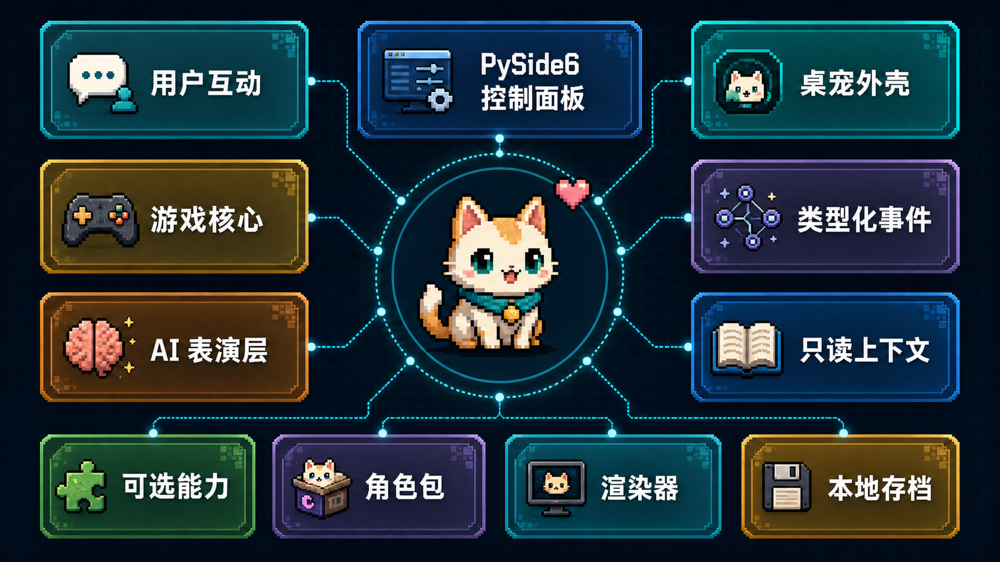

# E-Moti

[English](README.md) | [简体中文](README.zh-CN.md)



## 项目定位

E-Moti 是一个使用 Python 与 PySide6 开发、面向 Windows 的桌面 AI 电子宠物。它把桌面常驻、轻量养成、情感记忆、主动陪伴、多角色切换与 AI 角色表演结合在一起。游戏状态由本地规则控制，AI 用于让角色更会说、更会演，并结合共同经历和只读上下文作出更有个性的反应。

当前美术生产采用**类 hatch-pet 像素宠序列帧工作流**：先锁定统一的角色基准，再逐行动画生成与审核，通过序列帧总览检查，只修复失败的动画行，最后将通过验证的角色包接入运行时。

课程交付版本内置三套可见、可快速切换的角色包：`xingxi_pixel_pet`、`ikaros_pixel_pet` 和 `nairong_pixel_pet`。星汐是默认原创角色；伊卡洛斯和奶龙用于验证同一套角色包、渲染器、独立记忆、商店主题和角色音色配置能否兼容不同风格的角色。

> 学习、休息、安慰和玩耍只是动作状态。E-Moti 不是效率助手、课程监督者、吉祥物换皮或只有聊天框的 AI 外壳。

## 设计原则

- 本地规则负责状态、资源、背包、关系、回忆、目标、金币和存档。
- AI 负责增强角色台词、表情、动作提示和只读上下文表现。
- 屏幕观察、联网搜索、TTS 与 ASR 是可选的陪伴增强能力，不接管养成状态机。

## 当前功能

- PySide6 控制面板：状态、互动、商店、背包、关系、回忆、对话和设置。
- 桌宠模式：透明置顶窗口、轻量交互和桌面常驻演出。
- 系统托盘：隐藏、恢复、进入桌宠模式和退出。
- 三角色切换：`xingxi_pixel_pet`、`ikaros_pixel_pet`、`nairong_pixel_pet` 可在同一运行时切换。
- 本地养成闭环：心情、信任、金币、等级、背包、关系解锁和长期记忆。
- 情感记忆 V2：保存可追溯的共同经历，支持分类召回、固定、纠正、忘记，并按角色隔离。
- 星屑回忆册：展示第一次、小默契、礼物与纪念、共同日常、关于你和关系章节。
- 探头时刻：支持安静时段、冷却、每日上限、三种玩家回应和非阻塞倒计时。
- Plugin Runtime 与插件中心：提供清单校验、权限与依赖展示、静态审计、可撤销注册、故障隔离和 JSON 设置。
- 三个内置插件：能力接口、本地表达兜底，以及完整演示插件生命周期的“星图角落”。
- 角色包系统：每个角色拥有独立的美术资源、角色设定、商店主题、音色配置元数据和存档命名空间。
- 像素宠序列帧路线：使用可验证的 spritesheet、motion manifest、contact sheet、provenance 和 QA 报告。
- AI 表达层：LLM 输出经过 typed events 校验后，才能进入 UI、动作和语音链路。
- 只读感知增强：屏幕摘要、联网搜索和主动话题可注入 expression context，但不能写入游戏状态。
- 语音能力：TTS 只消费已校验的角色 speech；ASR 只生成玩家输入文本，并通过 `DialogueRequest` 进入对话。
- Windows 打包：提供冻结应用、Inno Setup 安装器和课程便携包构建脚本。

## 架构设计

E-Moti 按“本地规则核心 + AI 表演层 + 可插拔角色包”组织：

| 层 | 主要模块 | 职责 |
| --- | --- | --- |
| UI 与桌面外壳 | `app.py`, `capability_panels.py`, `desktop_shell.py`, `tray_controller.py` | 控制面板、桌宠窗口、托盘生命周期、设置入口 |
| 游戏核心 | `controller.py`, `engine.py`, `actions.py`, `models.py`, `storage.py` | 状态机、互动效果、金币/背包/等级、存档 |
| 故事与记忆 | `emotional_memory_service.py`, `memory_integration_bridge.py`, `memory_album_controller.py`, `companion_story_runtime.py` | 情感记忆、关系章节、召回、回忆册操作和可追溯共同经历 |
| 主动陪伴 | `focus_companion.py`, `focus_companion_runtime.py`, `proactive_companion.py` | 低频探头、安静时段、冷却、玩家回应和主动话题 |
| 角色与内容 | `character_pack.py`, `character_registry.py`, `character_session.py`, `character_resources.py` | 加载角色包、切换角色、隔离角色资源和会话数据 |
| AI 表达管线 | `expression_event_pipeline.py`, `ai_expressor.py`, `expression_parser.py`, `visual_actions.py`, `interaction_intents.py` | 将 LLM 响应解析成 typed events、speech、表情动作和只读意图 |
| 只读上下文 | `expression_context.py`, `ai_context_builder.py`, `screen_observation.py`, `web_search.py`, `topic_scout.py`, `proactive_companion.py` | 屏幕摘要、搜索卡片、主动话题和近期上下文 |
| 语音能力 | `voice_tts.py`, `voice_asr.py`, `voice_service_control.py`, `character_voice_profile.py` | 角色音色配置、TTS 播放、ASR 转写、服务检测 |
| 插件平台 | `plugin_host.py`, `plugin_runtime.py`, `plugin_subsystem.py`, `plugin_center_qt.py`, `plugin_provider_adapters.py` | 插件生命周期、能力 Provider、审计、权限、设置、隔离和可撤销扩展 |
| 渲染器 | `presentation_renderer.py`, `snapshot_renderer.py`, `spirit_stage.py`, `live2d_web.py` | sprite 基线渲染、portrait/spirit 研究路径、Live2D Web 适配路径 |
| 工具与验证 | `tools/`, `tests/`, `packaging/` | 角色包验证、像素美术 QA、LLM smoke、Windows 打包和回归测试 |

关键边界：

- LLM 不能修改成长状态、背包、关系、回忆、目标、金币或存档。
- 屏幕观察和联网搜索只产生只读上下文。
- ASR 只能产生玩家输入文本，并通过 `DialogueRequest` 进入对话。
- TTS 只能播放通过 typed events 校验后的角色台词。
- 插件只能通过宿主合同和可撤销注册提供能力；单个插件故障不会阻断基础游戏启动。
- 外部 AI 服务关闭后，本地养成、回忆册和本地表达兜底仍然可以运行。
- sprite renderer 是当前稳定基线；portrait、AI-video、LivePortrait 和 Live2D 是后续研究或扩展路线。

## 角色包结构

运行时角色包位于 `assets/companion/`：

```text
assets/companion/<character_id>/
  character.json
  dialogue_style.json
  motion_manifest.json
  spritesheet.png
  preview/contact-sheet.png
  preview/profile.png
  provenance.md
  qa_report.json
  shop_items.json
  LICENSE.md
```

当前内置角色：

- `xingxi_pixel_pet`：默认原创主角色。
- `ikaros_pixel_pet`：用于展示人形角色包、角色切换和角色音色工作流。
- `nairong_pixel_pet`：用于展示宠物向、搞笑向角色包的兼容性。
- `original_oc`：旧版兼容资源，保留用于历史 renderer 覆盖。

第三方或二创角色包应保留来源说明、生成记录、QA 证据和授权边界；公开分发前请确认你拥有对应权利。

## 快速开始

环境要求：

- Python 3.11+
- Windows 10/11
- PowerShell
- Inno Setup 6，仅在需要构建安装器时使用

安装开发环境：

```powershell
python -m venv .venv
.\.venv\Scripts\Activate.ps1
python -m pip install -U pip
python -m pip install -e .
python -m pip install pytest pyinstaller
```

启动控制面板：

```powershell
python -m guanghe_companion.app
```

启动桌宠模式：

```powershell
python -m guanghe_companion.app --pet-mode
```

使用演示存档：

```powershell
python -m guanghe_companion.app --demo-save
```

## 测试与验证

```powershell
python -m pytest
python -m pytest tests\test_app.py tests\test_desktop_pet_smoke.py -q
python -m pytest tests\test_repository_hygiene.py -q
```

最终本地集成基线通过 `1185` 项测试，其中包括 `327` 项记忆/插件聚焦测试，以及 Windows GUI 和构建冒烟验证。

验证角色包：

```powershell
python tools\validate_character_pack.py assets\companion\xingxi_pixel_pet
python tools\validate_character_pack.py assets\companion\ikaros_pixel_pet
python tools\validate_character_pack.py assets\companion\nairong_pixel_pet
python tools\validate_pixel_pet_pack.py assets\companion\xingxi_pixel_pet
```

构建 Windows 交付产物：

```powershell
powershell -ExecutionPolicy Bypass -File tools\build_windows_app.ps1
powershell -ExecutionPolicy Bypass -File tools\build_windows_installer.ps1 -SkipAppBuild
python tools\validate_windows_build.py --report artifacts\windows-build-validation.json
```

更多演示与交付操作：

- 演示快速上手：`docs\demo_operator_quickstart.md`
- 最终发布门禁：`docs\final_release_gate_2026-07.md`
- LLM 运维说明：`docs\llm_expression_operations.md`
- 角色包分发规则：`docs\character_pack_distribution_policy.md`
- 插件架构：`docs\PLUGIN_ARCHITECTURE_CN.md`
- 插件开发指南：`docs\PLUGIN_AUTHORING_GUIDE_CN.md`
- Windows 插件接入：`docs\WINDOWS_INTEGRATION_QUICKSTART_CN.md`

## 可选 AI 能力

E-Moti 可以在不接入网络服务的情况下运行。以下增强能力可在 UI 中配置：

- LLM 表达：OpenAI Responses、DeepSeek、OpenRouter、Ollama、LM Studio 或其他 OpenAI-compatible 服务。
- 屏幕观察：OpenAI-compatible 视觉模型接口。
- 联网搜索：通过 `ddgs` 使用 DuckDuckGo 搜索。
- TTS：Windows SAPI、Edge TTS 或本地 HTTP TTS 服务。
- ASR：OpenAI-compatible 转写接口或本地 Vosk 模型。

开源仓库不包含 API key、私有运行配置、对话历史、第三方模型权重或本地存档。

## 仓库结构

- `src/guanghe_companion/`：应用程序代码。
- `assets/companion/`：运行时角色包。
- `plugins/`：内置能力接口、本地表达兜底和“星图角落”示例。
- `public_config_template/`：不含密钥的公开能力与插件默认配置。
- `tests/`：回归测试、冒烟测试、打包测试和仓库卫生测试。
- `tools/`：验证、QA、发布检查、美术工作流与打包工具。
- `packaging/`：Windows 打包入口。
- `data/`：本地运行存档，已由 git 忽略。
- 生成草稿、本地模型研究、API key、对话历史和私有运行产物不得提交。

## 许可证

MIT，详见 `LICENSE`。
