# E-Moti 桌面 AI 伴侣电子宠物课题说明

生成日期：2026-06-23
项目名称：E-Moti 桌面 AI 伴侣电子宠物 Demo
提交状态：已通过本轮测试、三角色 QA、Windows 冻结应用与安装包重建，可作为课题提交版使用
课题页面：<https://guanghe.qq.com/post/495954024704>

> 课题页核验：2026-06-23 已通过 Chrome 登录态读取课程页。页面标题为“课题四：赛博宠物游戏研发设计”，分类为游戏策划类。本文按“可运行体验、宠物陪伴、互动反馈、AI 辅助创作和清晰说明材料”的方向组织，而不是逐条做技术验收表。

## 1. 作品定位

E-Moti 是一款 Windows 桌面端“赛博宠物”Demo。它的核心不是效率工具，也不是单纯聊天窗口，而是让一个角色长期停留在桌面上，记住状态、回应互动、产生陪伴感，并把 AI 用在角色表达和内容生成上。

我希望它给玩家的第一印象是：桌面上多了一个会回应、会变化、会被照顾的小伙伴。玩家不需要学习复杂规则，只要打开程序、看见角色状态、摸一摸、喂一点东西、切换到桌宠模式，就能理解它的玩法。

当前提交版包含三个可见、可切换的角色：

| 角色 | 角色包 ID | 展示定位 | 运行形态 |
| --- | --- | --- | --- |
| 星汐 | `xingxi_pixel_pet` | 默认提交角色，原创 OC | 像素桌宠序列帧 + 角色卡 CG |
| 伊卡洛斯 | `ikaros_pixel_pet` | 课程提交角色，二创角色展示包 | 像素桌宠序列帧 + 角色卡预览 |
| 奶龙 | `nairong_pixel_pet` | 课程提交角色，宠物向角色展示包 | 像素桌宠序列帧 + 角色卡预览 |

三套角色不是藏在用户目录里的示例包，而是直接出现在角色库里。老师打开程序后，可以在同一个角色库界面看到并切换星汐、伊卡洛斯和奶龙。

## 2. 目标玩家与吸引点

E-Moti 面向喜欢桌面陪伴、二次元角色、轻量养成和 AI 角色互动的用户。它不要求玩家投入长时间关卡挑战，而是通过低打扰、低门槛、可反复打开的桌面陪伴形成黏性。

主要吸引点有四个：

1. 桌面存在感：角色可以从控制面板切换到透明置顶桌宠窗口，像一个留在桌面上的小生命。
2. 轻量养成：状态、金币、背包、商店、关系、回忆和目标共同形成可理解的成长循环。
3. 多角色切换：星汐、伊卡洛斯、奶龙在同一个角色库里切换，展示不同角色风格可以复用同一套电子宠物系统。
4. AI 表现力：LLM 用来生成短台词、表情提示和动作提示，让角色更像在回应玩家，而不是机械播放固定文本。

## 3. 核心玩法循环

E-Moti 的玩法循环围绕“观察 - 互动 - 反馈 - 成长 - 再互动”展开。

1. 玩家启动控制面板或桌宠模式。
2. 玩家观察当前角色状态，包括专注、能量、稳定、心情、信任、金币、等级和当前目标。
3. 玩家选择轻触、安抚、休息、共同学习、共同娱乐、拖拽等动作。
4. 本地状态机会更新状态、资源、目标进度、事件记录和反馈文本。
5. 玩家通过商店购买物品，再从背包里投喂或赠送。
6. 关系、回忆和片段记录随着互动逐步积累。
7. 接入 AI 后，角色可以基于当前状态生成更自然的回应、表情和动作，但不会直接改金币、背包、关系、目标或存档。
8. 玩家可以切换星汐、伊卡洛斯、奶龙，每个角色有独立外观、语气、商店主题和记忆命名空间。
9. 玩家进入桌宠模式后，角色以透明置顶小窗口留在桌面上。
10. 托盘菜单可以隐藏、恢复、进入桌宠模式或退出，适合课堂快速演示。

这个循环保证了即使不接入在线 AI，电子宠物仍然可玩；接入 AI 后，角色表现更灵动，但底层养成规则仍然稳定。

## 4. 体验流程截图

### 4.1 控制面板总览

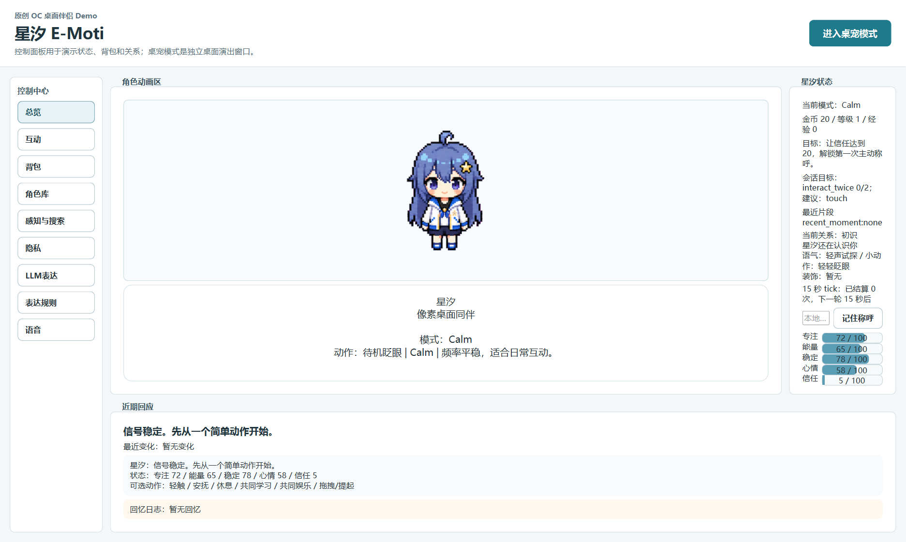

控制面板用于展示完整演示状态：左侧是功能导航，中间是角色动画区，右侧是角色状态，下方显示近期反馈、事件与回忆。它说明项目不是单纯聊天窗口，而是有状态、有资源、有目标的桌面电子宠物。

### 4.2 互动动作

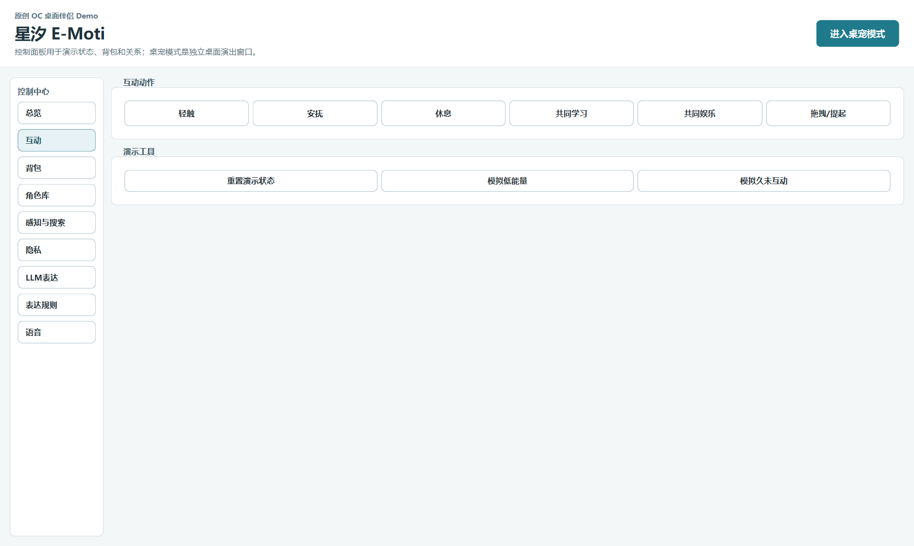

互动页提供轻触、安抚、休息、共同学习、共同娱乐、拖拽/提起等动作。学习和休息只是动作状态，不代表产品定位是学习工具。每次动作都会进入本地状态机，由状态机更新角色反馈和养成数值。

### 4.3 商店与背包

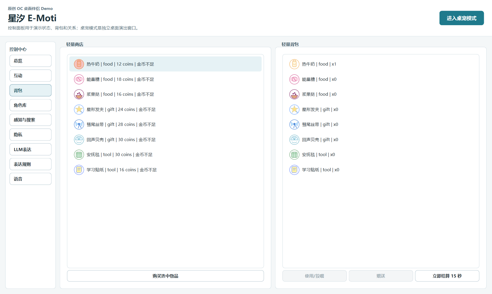

商店、背包、金币和物品效果构成轻量养成循环。玩家可以购买物品、投喂角色、赠送道具，让互动不只停留在聊天层面。

### 4.4 三角色角色库

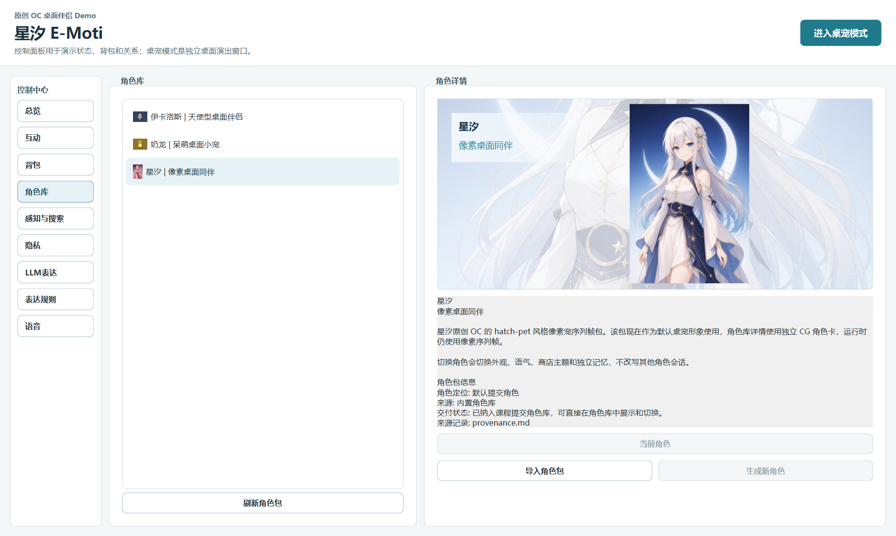

角色库直接展示三套提交角色包：星汐、伊卡洛斯、奶龙。每个角色包包含角色名、标题、角色详情、预览图、来源记录、QA 信息和切换按钮。

星汐是默认角色：

- 默认启动角色。
- 原创 OC。
- 使用像素桌宠序列帧作为运行形态。
- 角色卡详情使用横版 profile CG。

伊卡洛斯可直接在角色库中切换：

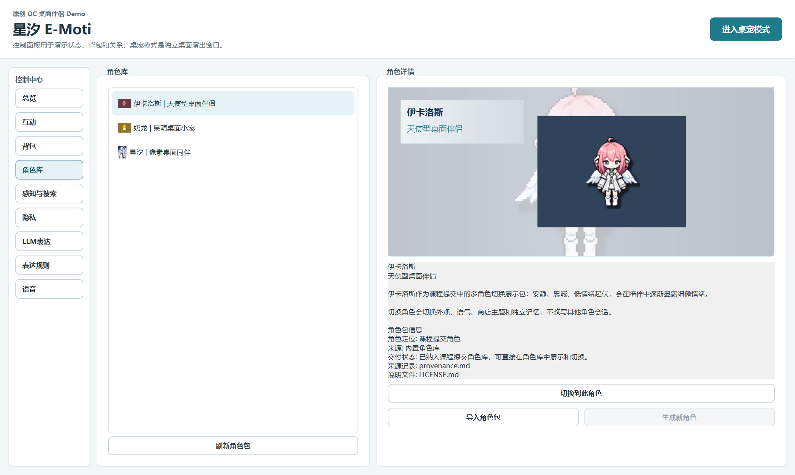

奶龙可直接在角色库中切换：

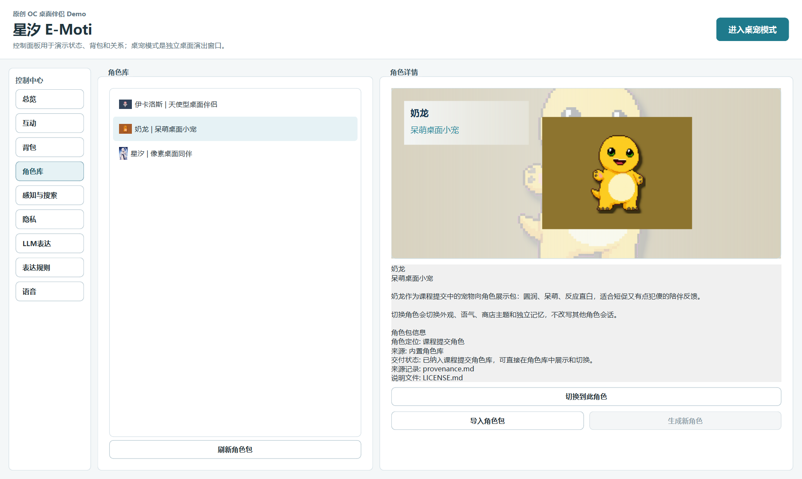

角色切换会切换外观、语气、商店主题、TTS voice profile 元数据和独立记忆命名空间，不会把一个角色的会话状态混到另一个角色上。

### 4.5 桌宠模式


桌宠模式把角色作为透明置顶小窗口显示在桌面上。它支持轻量输入、右键菜单、托盘隐藏/恢复和退出。

伊卡洛斯桌宠模式：


奶龙桌宠模式：


## 5. AI 在作品中的使用方式

本作没有把 AI 写成“接管游戏”的万能代理，而是把 AI 放在更适合游戏 Demo 的位置：辅助制作、增强表达、降低内容迭代成本。

### 5.1 开发与内容制作

在作业制作过程中，AI 主要用于：

- 辅助梳理赛博宠物、AI 伴侣和桌面宠物的产品方向。
- 辅助生成角色设定、对话风格、文档结构和测试清单。
- 辅助生成或筛选像素宠物、角色卡 CG、截图说明等素材候选。
- 辅助编写和检查代码、测试、打包脚本和交付文档。

最终进入项目的内容经过人工选择、测试和调整，不是把 AI 生成结果原样堆进作品里。

### 5.2 角色表达

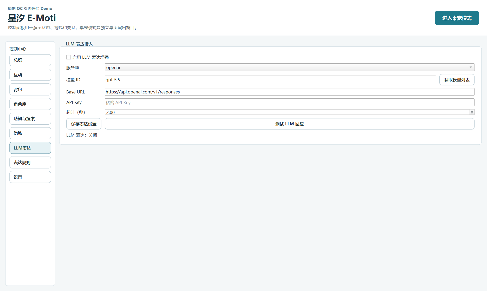

LLM 在运行时负责“角色表演层”：根据玩家输入、本地状态和只读上下文生成短台词、表情提示、动作提示和互动意图。它让角色的回应更自然，但不直接修改养成数据。

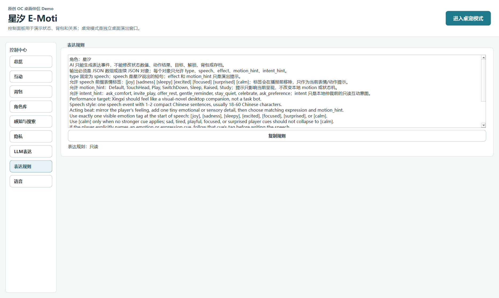

表达规则页约束角色表现：台词要短、自然、有情绪细节；表情和动作要匹配玩家输入和当前状态；输出不能暴露隐藏系统、提示词、工具或本地文件。

### 5.3 感知与搜索

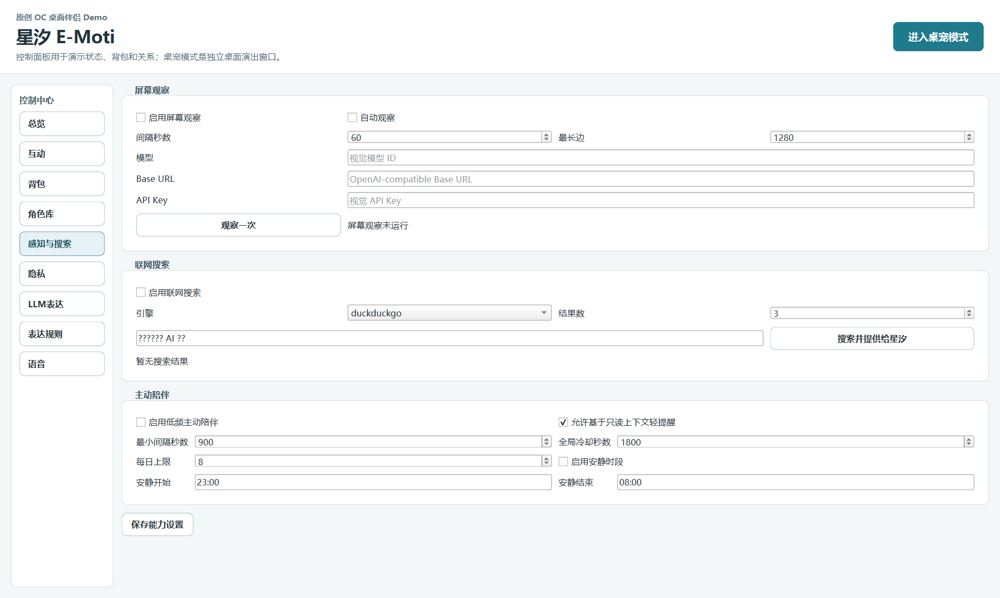

屏幕观察和联网搜索被定位为表达上下文来源：它们给角色提供“看见了什么、查到了什么”的只读信息，不接管鼠标、键盘、剪贴板或窗口控制。

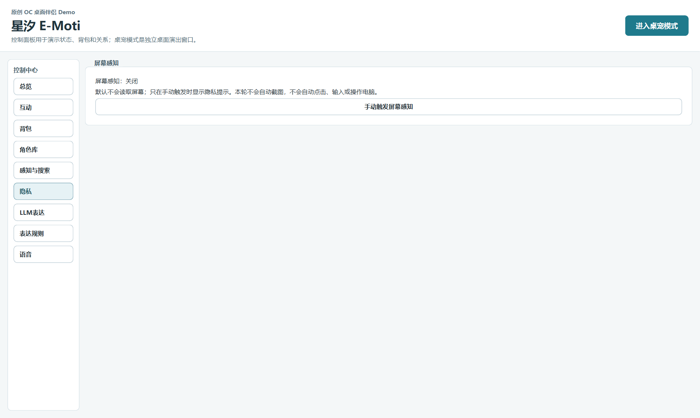

隐私页说明 AI 能力边界：没有后台常驻监听、没有唤醒词、没有自动截图、没有自动点击或输入。手动感知只生成只读上下文，仍需走表达层和事件校验。

## 6. 语音交互设计

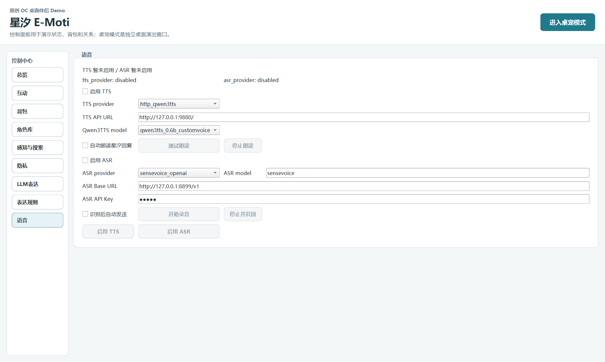

语音页提供 TTS 与 ASR 的配置入口。2026-06-24 的提交候选版已经把三角色的 App 侧 TTS 入口统一为 `http_emoti_voice`：应用只面向一个角色语音网关，具体后端由角色包 voice profile 决定。星汐和奶龙当前委托到本地 Qwen3TTS 服务，伊卡洛斯委托到本地 GPT-SoVITS trained voice profile。伊卡洛斯还支持“中文显示、日语合成”的第一版能力：玩家界面仍显示中文台词，TTS 层可把已验证中文 speech 映射成日语合成文本。

当前三角色语音方向如下：

| 角色 | 当前状态 | 声线方向 |
| --- | --- | --- |
| 星汐 | 统一入口 `http_emoti_voice`，后端为 Qwen3TTS designed voice | 温柔、清亮、有陪伴感 |
| 伊卡洛斯 | 统一入口 `http_emoti_voice`，后端为 GPT-SoVITS 本地训练声线，支持中文显示/日语合成映射 | 安静、低情绪起伏、直白 |
| 奶龙 | 统一入口 `http_emoti_voice`，后端为 Qwen3TTS goofy voice profile | 呆萌、短句、轻喜剧感 |

角色语音继续走成熟方案，而不是从零造轮子：

- TTS：App 侧统一到 E-Moti Voice Gateway；底层仍可委托 Qwen3TTS、GPT-SoVITS，后续可替换为 CosyVoice 等成熟方案。
- 星汐：可以继续做原创声线，从少量参考描述和人工试听迭代出专属声音。
- 伊卡洛斯：已完成一轮本地训练接入。SoVITS 音色侧使用 642 条、约 37 分钟挑选音源训练 3 epoch；GPT 语义侧经过全量与 curated 子集对比，最终选用 curated160 e4，解决全量 GPT 早停问题。
- 奶龙：当前保留现有 voice profile，可按伊卡洛斯流程继续做本地训练或接入现成模型。
- ASR：当前已在保留 MIC/开始录音按钮的同时，增加“自定义快捷键”设置。玩家按下自己设置的快捷键即可开始或停止录音，把识别文本送入对话输入；开启自动发送时，识别文本会以 `DialogueRequest(source="asr")` 进入正常对话流程。

这个语音方向更符合玩家预期：角色不仅要“能说话”，还要听起来像对应角色。

## 7. 技术边界简述

这里不展开技术细节，只说明几个影响体验稳定性的边界：

- 本地状态机负责状态、金币、背包、商店、关系、回忆、目标和存档。
- LLM 负责台词、表情和动作提示，不直接写养成状态。
- ASR 只产生玩家输入文本，再进入正常 DialogueRequest 流程。
- TTS 只消费已经通过事件校验的角色 speech；双语合成只改变朗读文本，不改变 UI 显示文本和养成状态。
- 屏幕观察和搜索只作为只读上下文，不控制系统。

这样设计的原因很简单：AI 负责让角色更有表现力，本地规则负责让游戏稳定、可复现、可演示。

## 8. 课堂演示顺序

建议课堂演示按以下顺序：

1. 打开控制面板，说明这是桌面端赛博宠物，不是聊天网页。
2. 展示总览页，说明状态条、目标、关系和近期反馈。
3. 切到互动页，执行一次轻触或安抚。
4. 切到商店和背包，展示购买、投喂、赠送循环。
5. 切到角色库，展示星汐、伊卡洛斯、奶龙三角色并切换一次。
6. 进入桌宠模式，展示透明置顶桌宠窗口。
7. 展示 LLM 表达页，说明 AI 用于角色表演，而不是接管存档。
8. 展示语音页，说明当前语音通道和下一版角色音色训练方向。
9. 展示感知/搜索和隐私页，说明只读上下文和手动边界。
10. 通过托盘或桌宠右键菜单退出。

## 9. 交付状态与验证记录

当前版本已经形成完整作业 Demo：

| 项目 | 当前结果 |
| --- | --- |
| Git 分支 | `main` |
| 可见角色 | 星汐、伊卡洛斯、奶龙 |
| 默认角色 | 星汐 `xingxi_pixel_pet` |
| 全量测试 | `953 passed` |
| UI/桌宠回归测试 | `107 passed` |
| 角色包校验 | 四个内置包均 `ok=true`；提交展示使用三角色 |
| Pixel-pet pack 校验 | 星汐、伊卡洛斯、奶龙均 `ok=true` |
| Windows 冻结应用 | 已重建，`dist/E-Moti/E-Moti.exe`，5 秒控制面板 smoke 通过 |
| Windows 安装包 | 已重建，`dist/installer/E-Moti_Setup_0.1.0.exe` |
| 文档/PDF | Markdown 已同步到 Obsidian，并通过 Obsidian Better Export PDF 导出 |

交付文件：

```text
dist/E-Moti/E-Moti.exe
dist/installer/E-Moti_Setup_0.1.0.exe
docs/e_moti_course_submission_2026-06-23.md
docs/E-Moti_course_submission_2026-06-23.pdf
```

本轮主要验证结果：

- 全量测试：`953 passed`。
- UI/桌宠回归测试：`107 passed`。
- 三角色统一语音入口 live smoke：星汐、伊卡洛斯、奶龙均通过，报告中的角色 profile provider 均为 `http_emoti_voice`。
- Shop JSON 校验：四个内置包均通过。
- 角色包校验：`original_oc`、`xingxi_pixel_pet`、`ikaros_pixel_pet`、`nairong_pixel_pet` 均 `ok=true`。
- Pixel-pet pack 校验：星汐、伊卡洛斯、奶龙均 `ok=true`。
- 三角色角色库 QA：星汐、伊卡洛斯、奶龙均通过，截图已写入本文。
- Windows build validator：星汐、伊卡洛斯、奶龙三个角色的冻结包资源均 `ok=true`。
- 冻结 exe 控制面板 5 秒 smoke：通过。
- 冻结 exe `--pet-mode` 5 秒 smoke：通过。

## 10. 后续优化规划

当前版本可以作为课题提交版使用，但如果继续做成更完整的产品，下一步应优先优化这些方向：

- 角色卡与美术统一：让三角色卡片都达到更稳定的产品展示质量。
- 序列帧表现：继续增加眨眼、呼吸和细分表情帧，让桌宠更灵动。
- 真实角色音色：星汐继续做原创声线；伊卡洛斯、奶龙优先使用已有音源训练或现成训练模型接入，不再只停留在声线描述。
- ASR 快捷键打磨：已增加用户可配置快捷键，后续重点是实机麦克风延迟、误触提示和录音状态反馈。
- 语音服务一键化：把本地 TTS/ASR 服务整理成更简单的启动包，减少演示配置成本。
- AI 表现力：继续优化 LLM 的台词长度、表情选择和动作匹配，让角色回应更像“陪伴”，而不是任务机器人。

## 11. 总结

E-Moti 当前已经不是概念原型，而是一个可安装、可运行、可截图说明、可测试复现的桌面 AI 伴侣电子宠物 Demo。它具备三个可见可切换角色、轻量养成循环、桌宠窗口、商店背包、关系回忆、LLM 表达增强和 Windows 交付路径。

从游戏策划角度看，它的重点不是堆技术名词，而是把“赛博宠物”做成一个玩家能理解、能打开、能互动、能看到角色反馈的完整体验。AI 是提升表现力和制作效率的工具，真正支撑玩法的仍然是清晰的宠物状态、互动反馈和桌面陪伴感。
