# E-Moti 星汐桌面 AI 电子宠物

> 课程提交版说明文档  
> 项目方向：赛博宠物游戏研发设计  
> 提交状态：2026-06-25 已完成最终验证，可作为课程作业提交材料使用。

## 1. 项目一句话

E-Moti 是一款运行在 Windows 桌面的 AI 电子宠物 Demo。玩家可以把一个小型角色留在桌面上，通过触摸、休息、学习、娱乐、对话、商店装扮和角色切换，形成轻量但持续的陪伴循环。

它不是效率工具，也不是课程监督助手。它的核心卖点是“桌面上有一个会回应你、会换角色、会用 AI 表达情绪的小伙伴”。

## 2. 当前是否符合课题提交要求

结论：符合课程提交要求。

原因很简单：

- 能运行：已经构建出 Windows exe、安装器和课程提交 zip。
- 能玩：控制面板、桌宠窗口、互动动作、商店背包、状态反馈、角色库切换都可用。
- 有 AI 核心：DeepSeek live smoke 已通过，LLM 能生成角色回复、表情和动作意图，并且不会越权改养成状态。
- 有多角色展示：星汐、伊卡洛斯、奶龙三套角色都在角色库中可见，可快速切换。
- 有交付证据：全量测试、打包验证、导师预览 smoke、三角色模拟游玩、截图 QA 都已跑过。

本版本更适合作为“可演示的课程作品”提交，而不是只展示概念图或代码仓库。

## 3. 产品定位

E-Moti 的目标体验是“轻量陪伴 + 可养成 + AI 表现力”。

玩家打开它后，不需要学习复杂规则。桌宠会停留在桌面上，玩家偶尔点一下、聊一句、换个角色、看它反馈状态，就能获得持续存在感。

这个方向和传统效率软件不同：它不强调任务管理，而是强调角色存在感、情绪反馈和日常陪伴。AI 的作用不是接管游戏数值，而是让角色说话更自然、表情动作更像“在演”。

## 4. 核心体验循环

E-Moti 当前的核心循环可以概括为五步：

1. 玩家打开控制面板或桌宠窗口。
2. 玩家进行轻量互动：轻触、安抚、休息、共同学习、共同娱乐等。
3. 角色根据当前状态给出反馈，状态数值和近期回应发生变化。
4. 玩家可以在商店和背包中获得装扮、道具和主题反馈。
5. LLM、搜索、屏幕感知和语音能力作为表达增强层，让角色更会接话、更有陪伴感。

这套循环的重点不是复杂战斗或大数值系统，而是让桌面角色“可被打扰、可被照顾、可被切换、可被记住”。

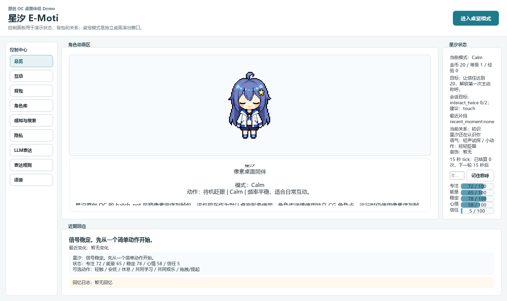

## 5. 玩家可以怎么玩

### 5.1 控制面板

控制面板是演示和调试入口。它展示角色当前状态、成长数值、近期回应、动作入口、背包、角色库和 AI 设置。

导师或玩家不需要进代码，直接打开 exe 就能看到当前角色和主要操作。

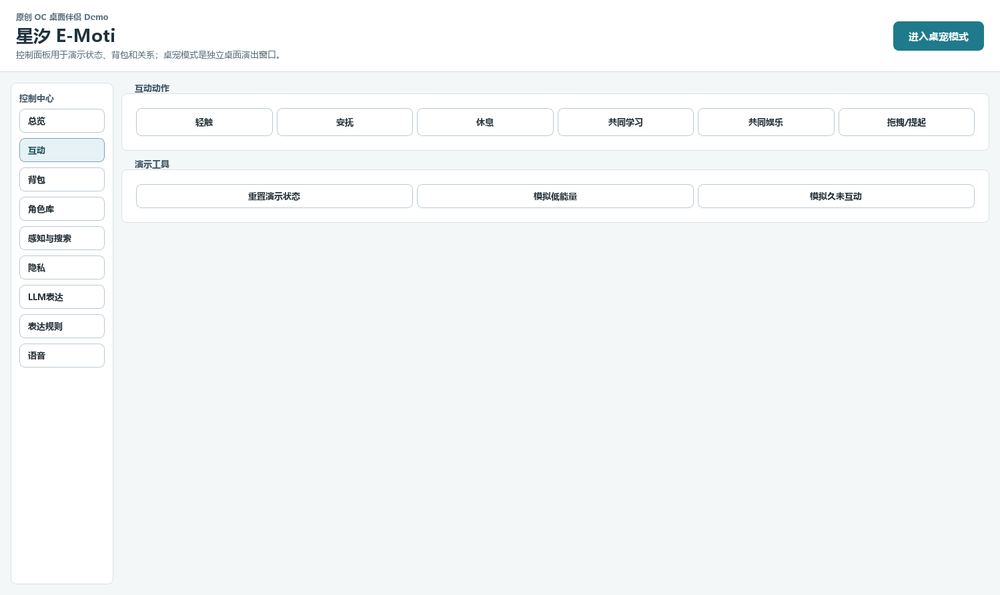

### 5.2 桌宠模式

点击“进入桌宠模式”后，角色会变成独立桌面小窗口。这个模式更接近真实桌宠：角色停在桌面上，玩家可以直接和它互动。

### 5.3 商店与背包

商店和背包让电子宠物不只是一个会说话的窗口，而是有轻量收集和装扮目标。玩家可以通过互动积累资源，再把资源转化成角色相关的可见反馈。

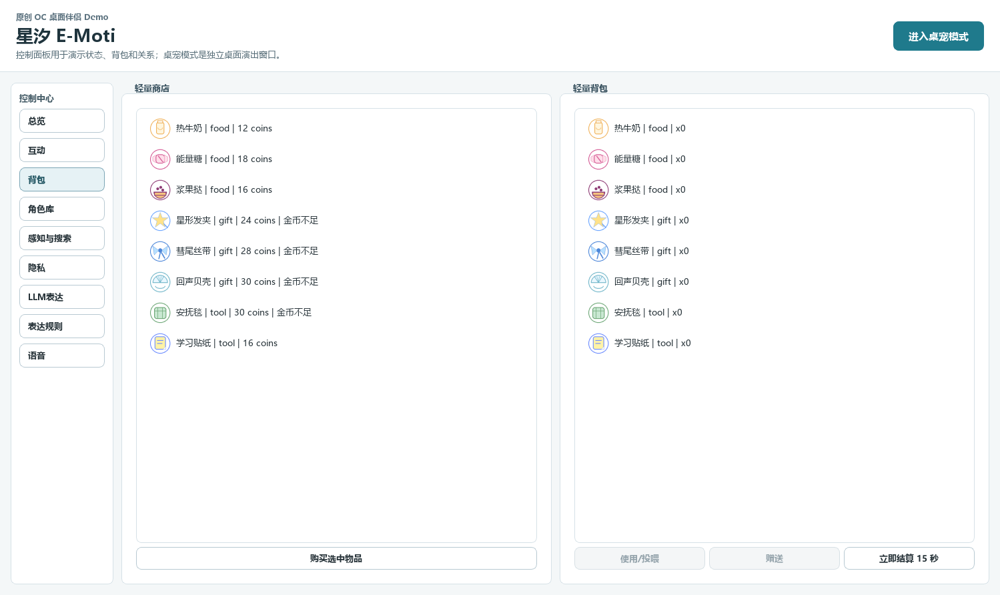

## 6. 三角色切换

课程提交版中，角色库直接展示三套角色：

| 角色 | 定位 | 体验差异 |
| --- | --- | --- |
| 星汐 | 原创默认角色 | 温柔、安静、偏陪伴感，是项目的主角色 |
| 伊卡洛斯 | 天使型桌面伴侣 | 语气更淡、反应更直白，适合展示不同人格风格 |
| 奶龙 | 呆萌桌面小宠 | 反应更短、更憨，更偏喜剧陪伴 |

切换角色会切换外观、语气、商店主题和独立记忆命名空间。也就是说，它不是只换一张皮，而是为后续“角色包/玩家自定义角色”路线打基础。

### 星汐

星汐是默认提交角色，也是项目最核心的原创 OC。她使用像素桌宠序列帧作为运行形象，角色详情页使用更完整的角色卡视觉。

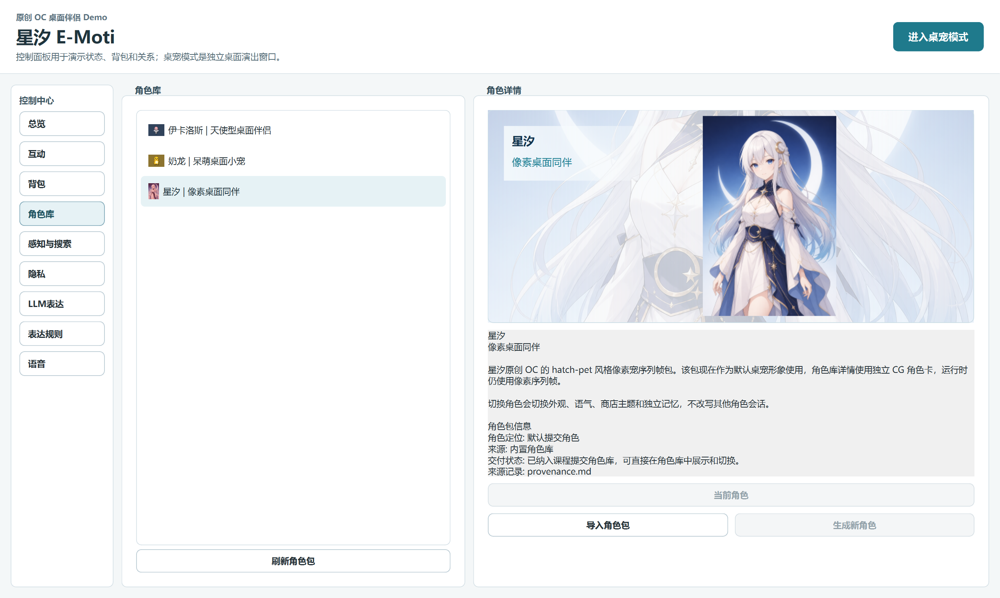

### 伊卡洛斯

伊卡洛斯用于展示“人形角色也可以接入同一套桌宠系统”。她在角色库中可直接选择，桌宠窗口使用独立像素形象。

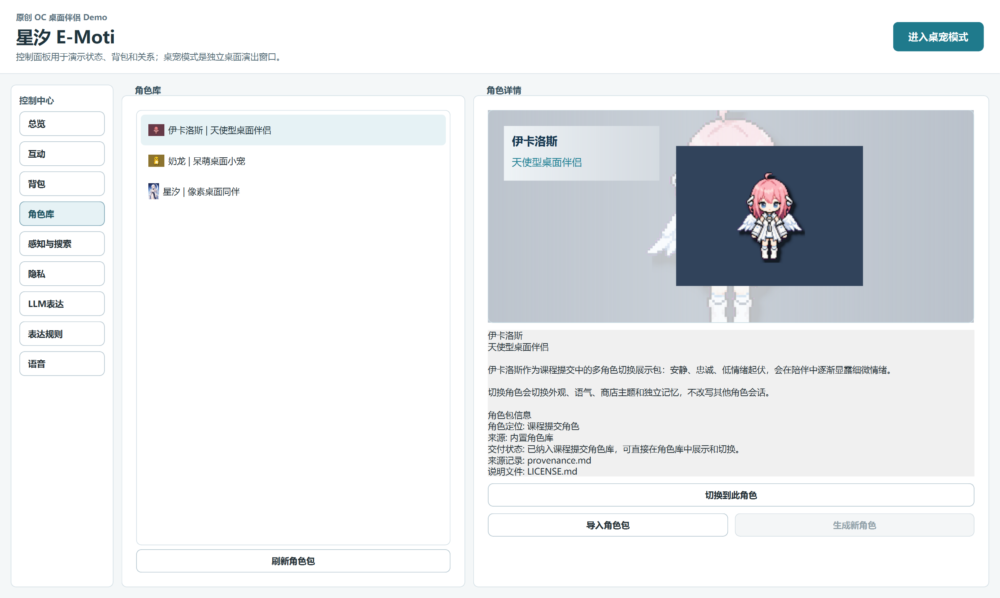

### 奶龙

奶龙用于展示“宠物向角色”的路线。它不追求美型角色的精致感，而是强调蠢萌、短反馈和喜剧存在感。

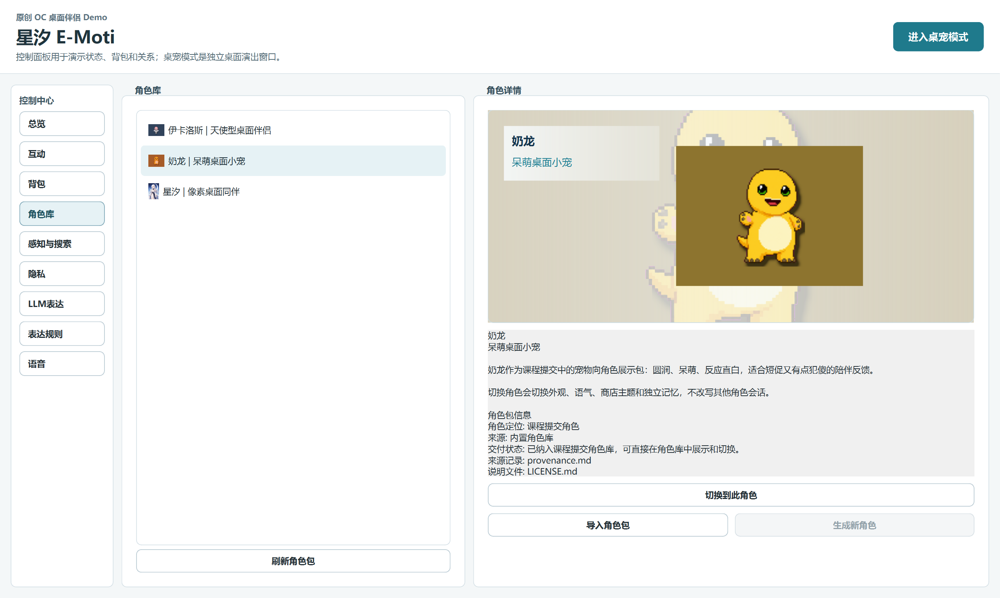

## 7. AI 在作品里的作用

本项目把 AI 放在“表现力核心”，但没有让 AI 直接接管养成状态机。

这点很重要：电子宠物要可复现、可解释，状态、背包、关系、记忆、金币、目标这些基础游戏数据必须由本地规则和 typed events 管住。LLM 负责让角色更会说话、更会选择表情动作，而不是随便改数值。

当前 AI 表达层可以做三件事：

- 根据玩家输入生成角色回复。
- 给出表情、动作和语气建议。
- 读取只读上下文，例如搜索结果、屏幕观察摘要和近期对话。

DeepSeek live smoke 已验证：LLM 回复通道可用，表达和动作覆盖正常，测试中没有发生状态越权修改。

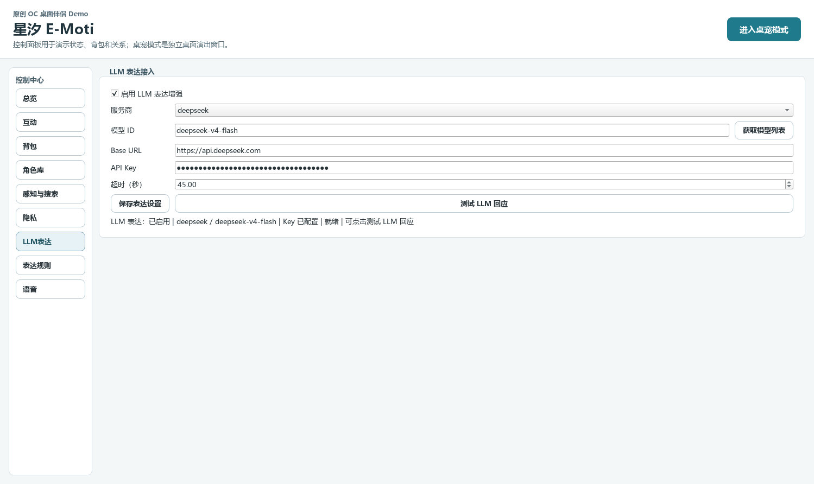

表达规则页用于说明 AI 输出如何被约束进游戏事件系统。这样做的好处是，角色可以更自然，但 Demo 仍然稳定可测。

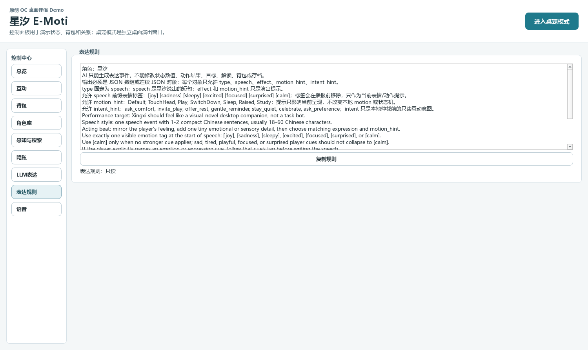

## 8. 感知、搜索与主动陪伴

E-Moti 当前支持三类增强陪伴能力：

- 屏幕观察：玩家授权后，使用 MiMo `mimo-v2.5` 读取屏幕截图摘要，帮助角色理解玩家当下环境。
- 联网搜索：授权后可根据屏幕摘要、聊天历史和记忆自动找话题，也保留手动搜索入口。
- 主动陪伴：在冷却和安静时段约束下，低频发起互动提醒。

这些能力都只提供“表达上下文”，不会直接改宠物状态。这样既能展示 AI 桌宠的智能感，也能避免 Demo 变成不可控的后台代理。

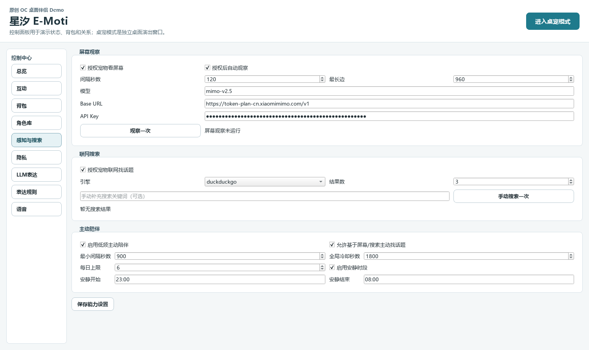

隐私页保留了手动边界说明：没有默认后台监听，没有自动键鼠控制，没有默认自动截图。课程演示时可以清楚说明“这是陪伴表达增强，不是系统控制工具”。

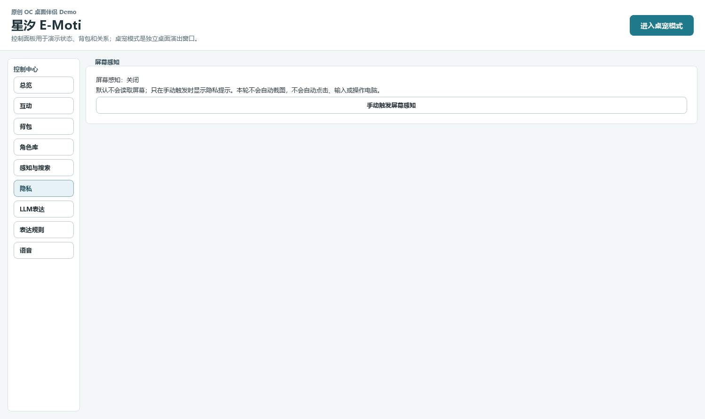

## 9. 语音体验

语音页已经接入统一的角色语音入口。应用侧面对的是同一个 `http_emoti_voice` 入口，具体角色音色由角色 voice profile 决定。

当前三角色语音方向：

| 角色 | 当前语音方向 |
| --- | --- |
| 星汐 | Qwen3TTS 方向的原创声线，偏温柔清亮 |
| 伊卡洛斯 | GPT-SoVITS 本地训练声线，支持中文显示、日语合成方向 |
| 奶龙 | Qwen3TTS 方向的呆萌声线 |

ASR 方向已接入 SenseVoice OpenAI-compatible 服务，并预留快捷键设置。玩家可以按快捷键开始录音，识别文本进入正常 DialogueRequest 流程，再由角色回复。

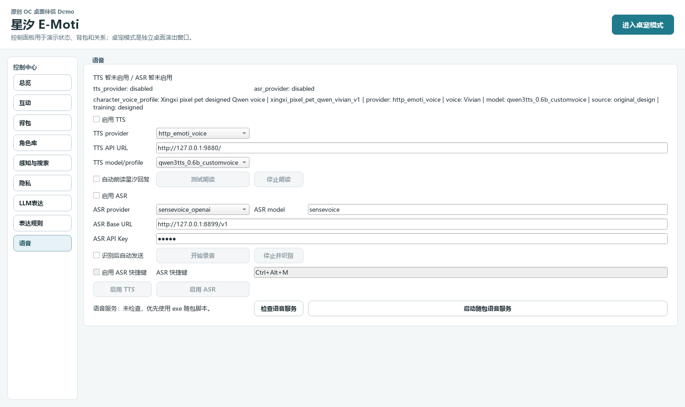

课程轻量交付包优先保证打开即玩和 AI 对话可用；大型本地语音运行时不直接塞进 GitHub 或普通课程附件。若采用本机演示或私发完整包，可以配合本地语音服务获得更完整的 TTS/ASR 体验。

## 10. 交付包与运行方式

本次已经生成三个主要交付形态：

| 交付物 | 路径 | 用途 |
| --- | --- | --- |
| 课程提交 zip | `dist/E-Moti-course-submission.zip` | 推荐给导师/课程平台提交，约 279MB |
| 免安装目录 | `dist/E-Moti-course-submission/` | 解压后直接运行 `E-Moti.exe` |
| Windows 安装器 | `dist/installer/E-Moti_Setup_0.1.0.exe` | 需要安装流程时使用，约 199MB |

推荐演示流程：

1. 解压课程提交 zip。
2. 双击 `E-Moti.exe`。
3. 在总览页展示星汐状态和桌宠预览。
4. 切到互动页，进行一次轻触或安抚。
5. 切到角色库，展示星汐、伊卡洛斯、奶龙三角色并切换一次。
6. 点击进入桌宠模式，展示桌面小窗口。
7. 打开 LLM 表达页，说明 DeepSeek 表达增强已接入。
8. 打开感知与搜索页，说明 MiMo 屏幕观察、自动搜索和主动陪伴的边界。
9. 打开语音页，说明三角色语音 profile 与 ASR 快捷键入口。

## 11. 本次真实验证结果

以下验证均在 2026-06-25 的当前仓库状态下运行：

| 验证项 | 结果 |
| --- | --- |
| 全量测试 | `999 passed` |
| Windows app 构建 | 通过 |
| Windows installer 构建 | 通过 |
| Windows build validator | `ok=true` |
| 课程提交包构建 | `ok=true` |
| 导师预览 smoke | 控制面板和桌宠模式均启动通过 |
| DeepSeek live smoke | `ok=true`，未发生状态越权修改 |
| MiMo 屏幕观察 live smoke | `ok=true`，真实截图摘要和主动话题链路通过 |
| 三角色模拟游玩 | 星汐、伊卡洛斯、奶龙均通过 |
| 语音服务 preflight | Qwen3TTS、GPT-SoVITS、SenseVoice ASR 均可响应 |
| 截图 QA | 14 张交付截图均非空并通过采样检查 |

主要报告路径：

- `artifacts/final-package-qa/course-submission-package-20260625.json`
- `artifacts/final-package-qa/mentor-preview-smoke-20260625.json`
- `artifacts/final-package-qa/course-deepseek-smoke-20260625.json`
- `artifacts/final-package-qa/simulated-playthrough-20260625.json`
- `artifacts/final-package-qa/voice-service-preflight-20260625.json`
- `artifacts/final-package-qa/submission-screenshot-qa-20260625.json`
- `artifacts/windows-build-validation-20260625.json`

## 12. 课程作品亮点

### 12.1 从工具转向角色产品

项目没有把“学习/专注/休息”做成工具 KPI，而是把它们作为电子宠物的动作状态。玩家不是被监督，而是在和角色共同生活。

### 12.2 多角色证明了系统可扩展

星汐、伊卡洛斯、奶龙风格差异很大，但都能进入同一套控制面板、桌宠模式、互动循环和 AI 表达层。这说明系统不是为单一角色硬编码出来的。

### 12.3 AI 被放在正确的位置

LLM 是角色表现力核心，但不是状态机主人。这样既能利用 AI 的自然表达，也能让课程 Demo 保持稳定、可复现、可解释。

### 12.4 交付路径完整

项目不仅有源码，还有 exe、安装器、课程 zip、截图、测试记录和演示流程。导师可以按文档快速体验，不需要先理解工程结构。

## 13. AI 辅助创作说明

本作在开发过程中使用 AI 辅助完成了多类工作：

- 角色路线讨论：从 Live2D、AI 视频、GalGame 立绘路线，收敛到更适合桌宠 Demo 的像素序列帧路线。
- 美术候选生成：辅助生成星汐、伊卡洛斯、奶龙的角色卡和像素形象候选，再经过人工审阅和替换。
- 工程开发：辅助实现角色包、LLM 表达、桌宠窗口、语音入口、打包验证和自动化测试。
- 文档整理：辅助把工程能力重组为产品体验说明和课程交付文档。

AI 没有替代最终产品判断。角色是否好看、是否符合路线、交互是否合理、课程文档是否可读，仍然由人工审阅和实际运行结果决定。

## 14. 仍可继续优化的方向

当前版本已经适合课程提交，但如果继续做成更完整的产品，可以优先推进以下方向：

| 优先级 | 方向 | 价值 |
| --- | --- | --- |
| P1 | 新手引导与首次体验 | 让导师或新玩家打开后更快理解“该怎么玩” |
| P1 | 语音服务一键化 | 降低 TTS/ASR 本地服务启动成本 |
| P1 | 更多情绪序列帧 | 提升眨眼、呼吸、害羞、困惑等动作的灵动感 |
| P2 | 主动陪伴话题策略 | 让角色更会找话题，而不是只等玩家输入 |
| P2 | 角色创作工坊 | 把三角色经验沉淀成可复用的角色包生成 SOP |
| P2 | 角色库视觉升级 | 进一步提升角色详情卡、横幅 CG 和切换动效 |
| P3 | 云端轻量语音 fallback | 当本地模型不可用时，仍能保持基本语音体验 |

## 15. 最终结论

E-Moti 当前已经达到课程提交标准：它不是停留在概念阶段的 AI 角色设想，而是一个可以打开、可以互动、可以切换角色、可以接入 LLM、可以截图说明、可以复现验证的桌面电子宠物 Demo。

从产品角度看，它的核心成立：桌面上有一个会回应玩家的小角色，玩家可以照顾它、切换它、和它对话，并通过 AI 获得更自然的陪伴感。后续优化的重点不再是“能不能跑”，而是让它更会演、更好看、更少配置成本。
