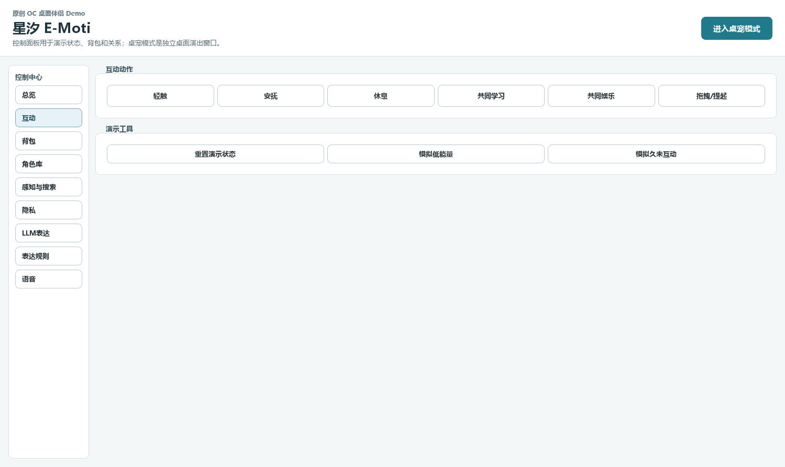
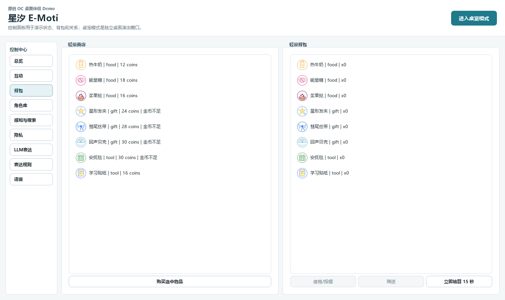
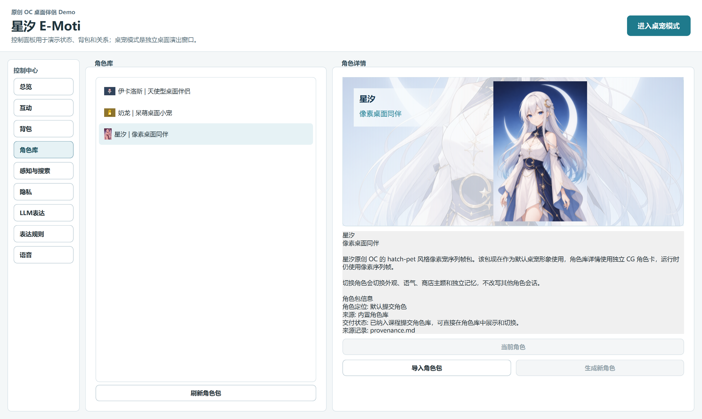
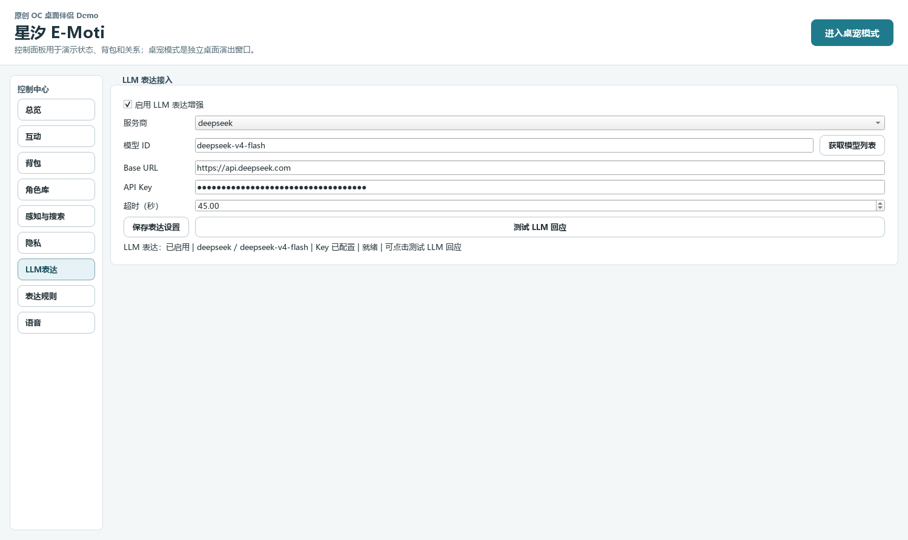
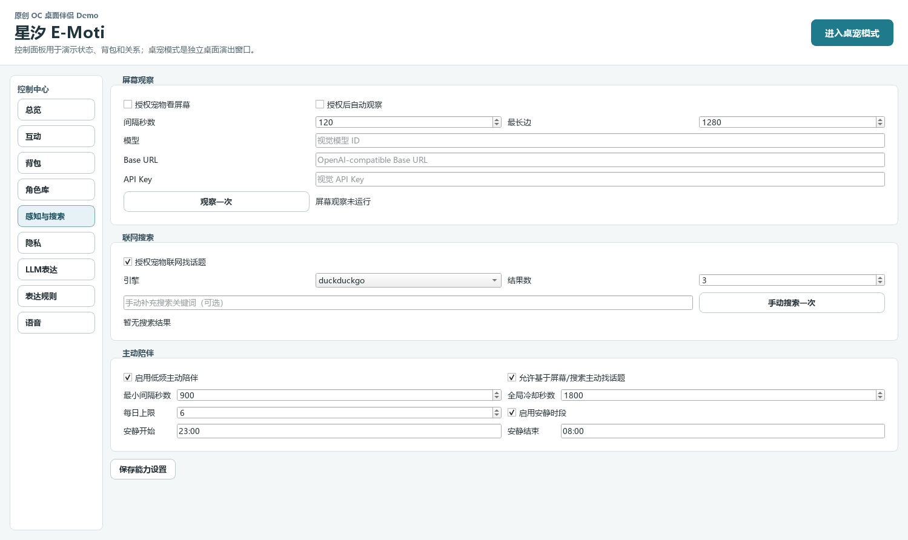

# E-Moti 星汐桌面赛博宠物

> 把 AI 从聊天框搬进桌面宠物：状态由游戏规则掌控，情绪与表演由 AI 赋予。

**课程方向：** 光核课题 - 赛博宠物游戏研发设计 
**提交版本：** 2026-06-25 课程可玩版 
**运行平台：** Windows 
**核心体验：** 桌面常驻、轻量养成、三角色切换、AI 角色演出、屏幕感知与主动话题增强

## 1. 作品概念

E-Moti 是一款运行在 Windows 桌面的轻量赛博宠物游戏。玩家可以把角色留在桌面上，通过触摸、安抚、休息、娱乐、对话、商店道具和角色切换，让宠物持续给出动作、台词、状态和近期反馈。

它不是任务监督工具，也不是套着角色外壳的普通聊天框。它想提供的是一种更日常的陪伴感：桌面上始终有一个可以被打扰、被照顾，也会用自己性格回应玩家的小伙伴。

课程提交版已经完成核心可玩闭环：玩家打开程序后无需进入代码，即可看到控制面板、进入桌宠模式、进行互动、切换三套角色，并在已配置环境中体验 AI 对话、屏幕感知和主动话题能力。

## 2. 玩家怎样玩

E-Moti 的基础循环很轻，但每一步都有明确反馈：

**选择互动 -> 角色即时回应 -> 状态与资源变化 -> 商店/背包转化 -> 下一次互动继续积累**

一次典型体验可以这样发生：

1. 玩家打开 E-Moti，星汐出现在控制面板和桌宠预览中。
2. 玩家进行轻触、安抚、休息或娱乐等动作。
3. 角色用动作和台词回应，状态、近期反馈或资源随之变化。
4. 玩家在商店与背包中购买、使用或赠送物品。
5. 角色带着新的状态、语气和上下文继续回应下一次互动。

这套循环不追求复杂战斗或重数值管理，而是用即时反馈、轻收集和角色记忆感，让桌面上的小角色不像一次性插件，而像可以被持续照看的宠物。

## 3. 三角色切换

课程提交包直接包含三套可见、可切换角色：星汐、伊卡洛斯、奶龙。它们不是被藏在附加包里的样例，而是本次演示体验的一部分。

| 角色 | 定位 | 体验差异 |
| --- | --- | --- |
| 星汐 | 原创默认角色 | 温柔、安静，强调稳定的桌面陪伴感 |
| 伊卡洛斯 | 天使型桌面伴侣 | 语气更淡、更直接，用于展示人形角色包路线 |
| 奶龙 | 呆萌桌面小宠 | 回应更短、更憨，强调喜剧感和宠物感 |

切换角色时，系统会同步切换外观、语气、商店主题、语音 profile 和独立记忆命名空间。也就是说，角色库不只是换一张皮，而是在验证 E-Moti 可以承载不同风格的角色包。

星汐是项目原创主角色；伊卡洛斯和奶龙用于课程演示中的角色包兼容性、差异化人格和玩家自定义方向展示。三个角色都可以在角色库中直接看到并切换，不需要导师额外翻隐藏目录。

## 4. AI 带来的角色演出

E-Moti 把 AI 放在“角色表现层”，而不是让 AI 接管养成状态机。

**玩家输入与当前状态 -> AI 生成角色台词、表情和动作建议 -> 本地规则校验 -> 角色以可用动作完成演出**

AI 当前主要负责三件事：

- 根据玩家输入、角色设定和近期上下文生成更自然的回复。
- 选择适合当前语境的表情、动作和语气。
- 在玩家授权后读取只读上下文，例如屏幕摘要、搜索结果和近期对话，用来主动找话题。

角色的状态、金币、背包、关系和目标仍由本地规则结算。这样做的好处是：AI 负责让宠物更会说、更会演，本地系统负责保证游戏稳定、可复现、可解释。

屏幕观察、联网搜索和主动陪伴都是可授权能力。开启后，宠物可以根据玩家当前屏幕和近期上下文找话题；关闭时，它不会默认后台监听、不会控制键鼠，也不会自动改动游戏数据。

## 5. 美术与角色包工作流

本项目最终采用“角色卡 CG + 像素桌宠序列帧”的组合。

前期试过更精细的 GalGame 立绘、AI 视频转序列帧、LivePortrait 和 Live2D 路线。它们的表现上限更高，但在课程周期内会遇到帧间一致性、边缘噪点、模型绑定、授权和制作成本问题。桌宠窗口本身尺寸很小，过于精细的立绘反而容易暴露缩放和动态模糊问题。

因此，提交版收敛到更稳定的像素宠物路线：桌面运行形象使用小尺寸序列帧，角色库详情使用更完整的角色卡视觉。这样既能保证小窗口里足够清楚，也能在角色库中展示角色气质。

像素宠物制作思路参考了 hatch-pet 的工作流：先锁定基准形象，再按 idle、touch、run 等动作行逐步生成和校验，最后通过 contact sheet 和运行时 smoke 检查。E-Moti 在此基础上定义了自己的角色包结构，让美术资产能进入角色库、桌宠渲染、对话风格、语音 profile、商店主题和记忆命名空间。

这部分的价值不只是“用 AI 画图”，而是验证了一条可复用的生产链：角色设定 -> 美术候选 -> 人工筛选与修正 -> 序列帧校验 -> 角色包接入 -> 实机切换。

## 6. 分工与 AI 使用说明

本课程版本由本人独立完成，覆盖产品定位、玩法循环、角色系统、AI 能力接入、前端界面、桌宠渲染、语音方案联调、测试、打包和交付文档整理。

| 阶段 | 使用方式 | 人工判断与验收 |
| --- | --- | --- |
| 产品与玩法 | 借助 AI 辅助梳理用户需求、竞品思路和路线取舍 | 最终范围按课程周期、可演示性和实机稳定性确定 |
| 程序开发 | 使用 Codex 辅助实现、重构、补测试和排查问题 | 进入提交包的代码均经过本机运行和测试验证 |
| 运行时对话 | 使用 DeepSeek 作为 LLM 演示通道 | 输出经过本地规则约束，只能影响台词、表情和动作建议 |
| 屏幕理解 | 使用 MiMo 视觉能力做授权后的屏幕摘要 | 只作为只读表达上下文，不控制电脑 |
| 语音能力 | 接入统一 voice profile 入口，联调 Qwen3TTS、GPT-SoVITS、SenseVoice ASR 等服务 | 不同角色使用独立音色方向，ASR 文本进入正常对话流程 |
| 美术生产 | 使用 AI 图像生成和 hatch-pet 式序列帧思路制作候选资产 | 人工筛选、修正、统一角色特征并做运行时 QA |
| 文档交付 | 使用 AI 辅助整理结构和语言 | 最终内容按真实仓库、截图和测试结果核对 |

AI 没有替代产品判断。哪些功能进入主循环、哪些美术路线被舍弃、哪些能力适合课程提交，都由实机效果和玩家体验目标决定。

## 7. 运行方式与完成度

推荐导师体验路径：

1. 解压课程提交包。
2. 双击 `E-Moti.exe`。
3. 在总览页查看星汐状态。
4. 进行一次轻触或安抚，观察即时反馈。
5. 打开商店与背包，查看资源循环。
6. 在角色库切换星汐、伊卡洛斯和奶龙。
7. 进入桌宠模式，在真实桌面上完成一次互动。
8. 在已配置环境中体验 AI 对话、屏幕感知、主动话题和语音入口。

当前已完成的交付形态：

| 交付物 | 用途 |
| --- | --- |
| `dist/E-Moti-course-submission.zip` | 推荐课程提交包，解压后直接运行 |
| `dist/E-Moti-course-submission/` | 免安装运行目录 |
| `dist/installer/E-Moti_Setup_0.1.0.exe` | Windows 安装器 |
| `docs/E-Moti_course_submission_2026-06-25_obsidian.pdf` | 课程说明 PDF |

当前验证摘要：

| 验证内容 | 结果 |
| --- | --- |
| 全量自动化测试 | `1007 passed` |
| Windows app / installer 构建 | 通过 |
| Windows build validator | `ok=true` |
| 导师预览 smoke | 控制面板与桌宠模式均可启动 |
| DeepSeek LLM live smoke | `ok=true`，未发生状态越权修改 |
| MiMo 屏幕观察 live smoke | `ok=true`，真实截图摘要与主动话题链路通过 |
| 三角色模拟游玩 | 星汐、伊卡洛斯、奶龙均通过 |
| 语音服务预检 | TTS/ASR 相关服务均可响应 |

完整测试报告、配置边界、角色包结构和素材说明见技术附件：[E-Moti 课程提交技术附件](e_moti_course_submission_technical_appendix_2026-06-25.md)。

## 8. 后续优化方向

课程提交版已经完成可运行、可演示、可复现的核心体验。若继续产品化，下一阶段优先做三件事：

| 优先级 | 方向 | 价值 |
| --- | --- | --- |
| P1 | 新手引导与首次体验 | 让第一次打开的人更快理解“该怎么玩” |
| P1 | 语音服务一键化 | 降低 TTS/ASR 本地服务启动成本 |
| P1 | 更多情绪序列帧 | 提升眨眼、呼吸、害羞、困惑等表现的灵动感 |
| P2 | 主动陪伴话题策略 | 让宠物更会找话题，而不是只等待玩家输入 |
| P2 | 角色创作工作坊 | 把三角色经验沉淀成可复用的角色包生成 SOP |
| P2 | 角色库视觉升级 | 提升角色详情卡、横屏 CG 和切换动效 |

E-Moti 当前交付的不是一份概念图，也不是只在代码仓库里存在的 AI 设想，而是一套可以打开、互动、养成、切换角色并获得 AI 表演反馈的桌面赛博宠物核心体验。
