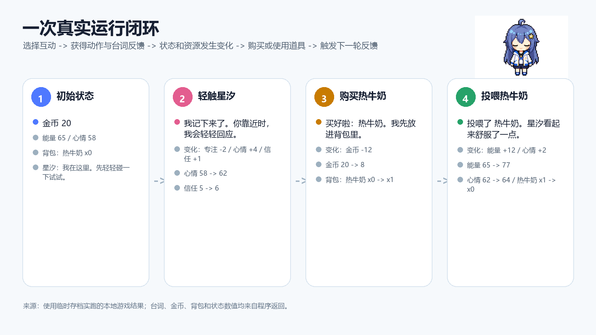
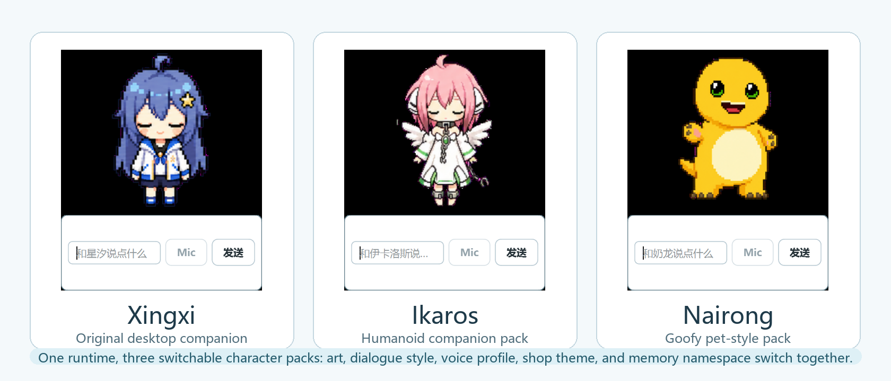

# E-Moti 星汐桌面赛博宠物

> 把 AI 从聊天框搬进桌面宠物：状态由游戏规则掌控，情绪与表演由 AI 赋予。

**课程方向：** 光核课题 - 赛博宠物游戏研发设计 
**作者／成员：** 申博（独立完成） 
**提交版本：** 2026-06-25 课程可玩版 
**运行平台：** Windows 
**核心体验：** 桌面常驻、轻量养成、即时反馈、多角色陪伴、AI 角色演出

## 1. 作品概念

E-Moti 是一款运行在 Windows 桌面的轻量赛博宠物游戏。玩家可以把角色留在桌面上，通过轻触、安抚、休息、娱乐、对话、商店道具和角色切换，让宠物持续给出动作、台词、状态和近期反馈。

它不是任务监督工具，也不是套着角色外壳的普通聊天框。它想提供的是一种更日常的陪伴感：桌面上始终有一个可以被打扰、被照顾，也会用自己性格回应玩家的小伙伴。

课程提交包可直接体验控制面板、桌宠互动、状态反馈、商店背包与三角色切换；AI 对话、屏幕理解、主动话题和语音能力属于预配置环境下的增强体验。

与传统以定时喂养和数值成长为主的电子宠物不同，E-Moti 将桌面常驻、多角色包与受游戏规则约束的 AI 角色演出结合，重点强化角色的日常存在感和个性化反馈。

## 2. 玩家怎样玩

E-Moti 的基础循环很轻，但每一步都有明确反馈：

**选择互动 -> 获得动作与台词反馈 -> 状态和资源发生变化 -> 购买或使用道具 -> 触发下一轮角色反馈**

*图：一次实机玩法闭环。数据来自实际运行存档，展示轻触、购买和投喂带来的台词、金币、背包及状态变化。*

一次典型体验可以这样发生：

1. 玩家打开 E-Moti，星汐出现在控制面板和桌宠预览中。
2. 玩家轻触星汐，她给出台词回应，同时心情和信任发生变化。
3. 玩家用金币购买热牛奶，背包中出现真实可用的道具。
4. 玩家投喂热牛奶，能量与心情提升，道具数量被消耗。
5. 角色带着新的状态、语气和上下文继续回应下一次互动。

本作以低操作门槛换取高频反馈，通过状态、资源和角色记忆形成轻量养成循环。重点不是复杂战斗或重数值管理，而是让桌面上的小角色不像一次性插件，而像可以被持续照看的宠物。

## 3. 三角色切换

课程提交包直接包含三套可见、可切换角色：星汐、伊卡洛斯、奶龙。三套角色均内置于课程提交包，可在角色库中直接切换。

| 角色 | 定位 | 体验差异 |
| --- | --- | --- |
| 星汐 | 原创默认角色 | 温柔、安静，强调稳定的桌面陪伴感 |
| 伊卡洛斯 | 天使型桌面伴侣 | 语气更淡、更直接，用于展示人形角色包路线 |
| 奶龙 | 呆萌桌面小宠 | 回应更短、更憨，强调喜剧感和宠物感 |

角色切换并非单纯替换外观，而是同步更换人格表达、商店主题、角色音色配置与角色独立记忆。也就是说，角色库验证的不只是换皮，而是 E-Moti 可以承载不同风格的角色包。

素材说明：星汐为本项目原创主角色；伊卡洛斯、奶龙相关形象仅用于非商业课程演示与角色包兼容性验证，其角色与原始知识产权归各自权利方所有。具体素材来源、AI 生成与人工修改过程见技术附件。

## 4. AI 带来的角色演出

E-Moti 把 AI 放在“角色表现层”，而不是让 AI 接管养成状态机。

**玩家输入与当前状态 -> AI 生成角色台词、表情和动作建议 -> 本地规则校验 -> 角色以可用动作完成演出**

*图：DeepSeek 对话演出与 MiMo 屏幕理解的真实调用结果，展示 AI 如何提供台词、表情动作和主动话题线索。*

AI 当前主要负责三件事：

- 根据玩家输入、角色设定和近期上下文生成更自然的回复。
- 选择适合当前语境的表情、动作和语气。
- 在玩家授权后，将屏幕摘要、搜索结果和近期对话作为只读上下文，用来主动找话题。

角色的状态、金币、背包、关系和目标仍由本地规则结算。AI 负责让宠物更会说、更会演，本地系统负责保证游戏稳定、可复现、可解释。

## 5. 美术与角色包工作流

本项目最终采用“角色卡 CG + 像素桌宠序列帧”的组合。前期试过更精细的 GalGame 立绘、AI 视频转序列帧、LivePortrait 和 Live2D 路线；它们的表现上限更高，但在课程周期内会遇到帧间一致性、边缘噪点、模型绑定、授权和制作成本问题。桌宠窗口本身尺寸很小，过于精细的立绘反而容易暴露缩放和动态模糊问题。

因此，提交版收敛到更稳定的像素宠物路线：桌面运行形象使用小尺寸序列帧，角色库详情使用更完整的角色卡视觉。这套流程参考 hatch-pet 的“小宠物序列帧”生产思路，但 E-Moti 在此基础上定义了自己的角色包结构，让美术资产能接入角色库、桌宠渲染、对话风格、角色音色、商店主题和记忆系统。

这部分的价值不只是“用 AI 画图”，而是验证了一条可复用的生产链：角色设定 -> 美术候选 -> 人工筛选与修正 -> 序列帧总览检查 -> 角色包接入 -> 实机切换。

## 6. 分工与 AI 使用说明

本课程版本由本人独立完成，覆盖产品定位、玩法循环、角色系统、AI 能力接入、前端界面、桌宠渲染、语音方案联调、测试、打包和交付文档整理。

| 阶段 | 使用的 AI / 工具 | 人工判断与验收 |
| --- | --- | --- |
| 产品设计 | ChatGPT、Codex 辅助梳理设计假设、竞品观察与方案取舍 | 最终范围按课程周期、可演示性和实机稳定性确定 |
| 程序开发 | Codex 辅助实现、重构、补测试和排查问题 | 进入提交包的代码均经过本机运行和测试验证 |
| 角色对话 | DeepSeek 作为 LLM 演示通道 | 输出经过本地规则约束，只能影响台词、表情和动作建议 |
| 屏幕理解 | MiMo 视觉模型用于授权后的屏幕摘要 | 只作为只读表达上下文，不控制电脑 |
| 语音能力 | Qwen3TTS、GPT-SoVITS、SenseVoice ASR 等方案用于角色语音方向验证 | 不同角色使用独立音色方向，ASR 文本进入正常对话流程 |
| 美术生产 | ChatGPT 图像生成、Codex 资产整理工作流，并参考 hatch-pet 像素宠序列帧工作流 | 人工筛选、修正、统一角色特征并做运行时 QA |
| 文档交付 | ChatGPT、Codex 辅助审阅结构、语言和排版 | 最终内容按真实仓库、截图和测试结果核对 |

AI 没有替代产品判断。哪些功能进入主循环、哪些美术路线被舍弃、哪些能力适合课程提交，都由实机效果和玩家体验目标决定。

## 7. 运行方式与完成度

推荐导师体验路径：

1. 解压 `dist/E-Moti-course-submission.zip`。
2. 双击 `E-Moti.exe`。
3. 在总览页查看星汐状态，并进入桌宠模式。
4. 进行一次轻触或安抚，观察即时反馈。
5. 打开商店与背包，购买或使用一个道具。
6. 在角色库切换星汐、伊卡洛斯和奶龙。
7. 在预配置环境中体验 AI 对话、屏幕理解、主动话题和语音入口。

能力边界如下：

| 类型 | 导师拿到包后的体验 |
| --- | --- |
| 课程提交包可直接体验 | 桌宠模式、基础互动、状态反馈、商店背包、三角色切换 |
| 预配置环境下可体验 | AI 对话、屏幕理解、主动话题、语音能力 |
| 课程版不提供 | 后台持续监听、鼠标键盘控制、开机自启、系统级自动化 |
| 授权后可启用 | 低频屏幕摘要、联网搜索、主动话题 |

当前验证摘要：

| 验证内容 | 结果 |
| --- | --- |
| 全量自动化测试 | `1007 passed` |
| Windows 免安装包与安装器构建 | 通过 |
| 构建与运行验证 | 通过 |
| DeepSeek / MiMo / 语音服务联调 | 真实调用验证通过 |

完整测试报告、配置边界、角色包结构和素材说明见随包文件：`E-Moti_course_submission_technical_appendix_2026-06-25.pdf`。

## 8. 后续优化方向

课程提交版已经完成可运行、可演示、可复现的核心体验。若继续产品化，下一阶段优先推进三件事：

| 优先方向 | 价值 |
| --- | --- |
| 新手引导与首次体验 | 让第一次打开的人更快理解“该怎么玩” |
| 更多情绪动作 | 提升眨眼、呼吸、害羞、困惑等表现的灵动感 |
| 语音服务一键化 | 降低 TTS / ASR 本地服务启动和交付成本 |

E-Moti 当前交付的是一套可直接打开、互动、养成和切换角色的桌面赛博宠物核心体验；在预配置环境下，还可进一步体验 AI 对话、屏幕理解、主动话题与语音演出。
