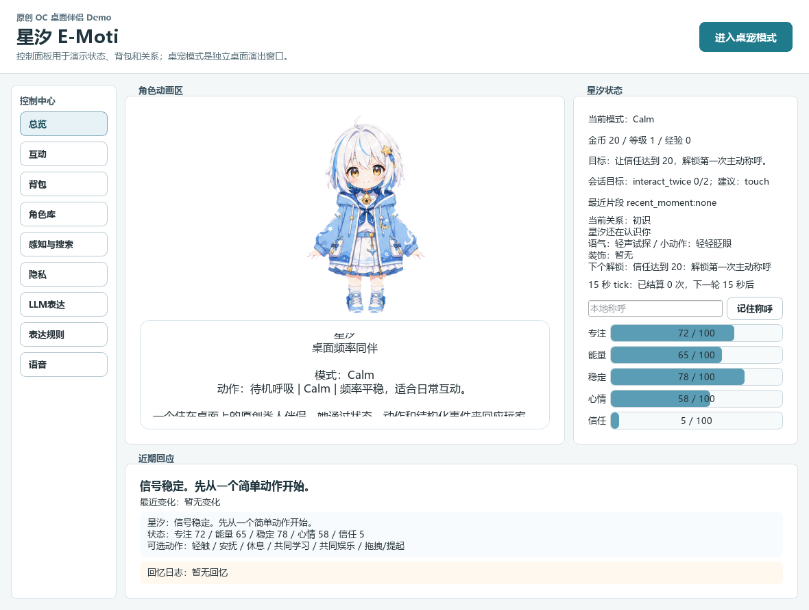
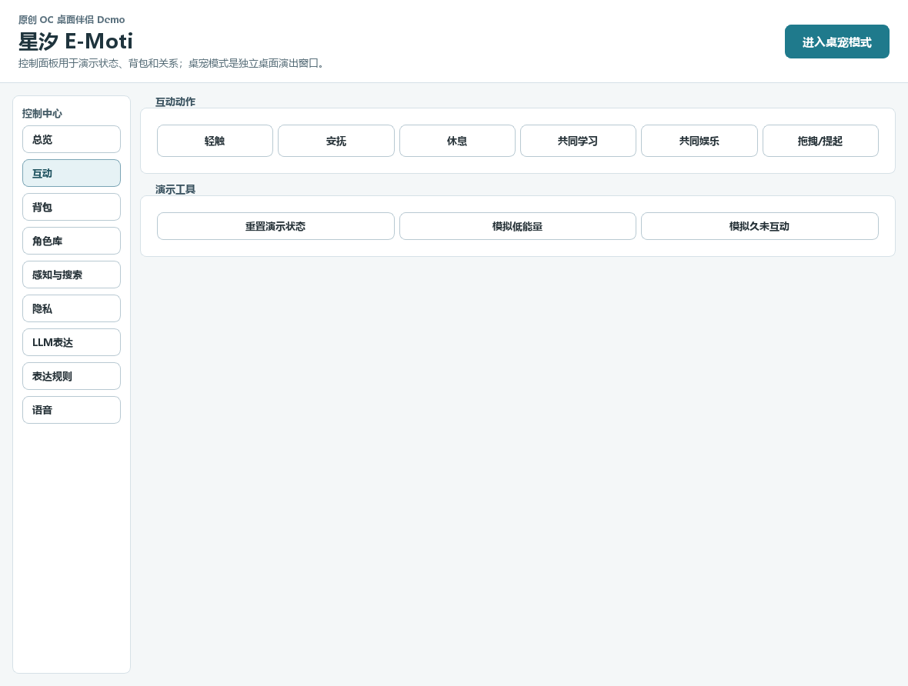
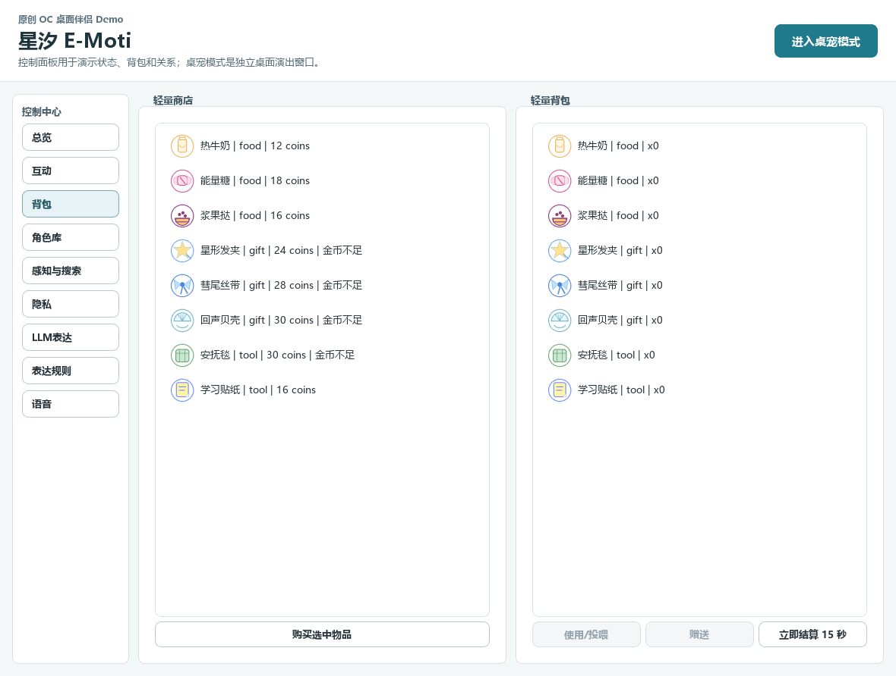
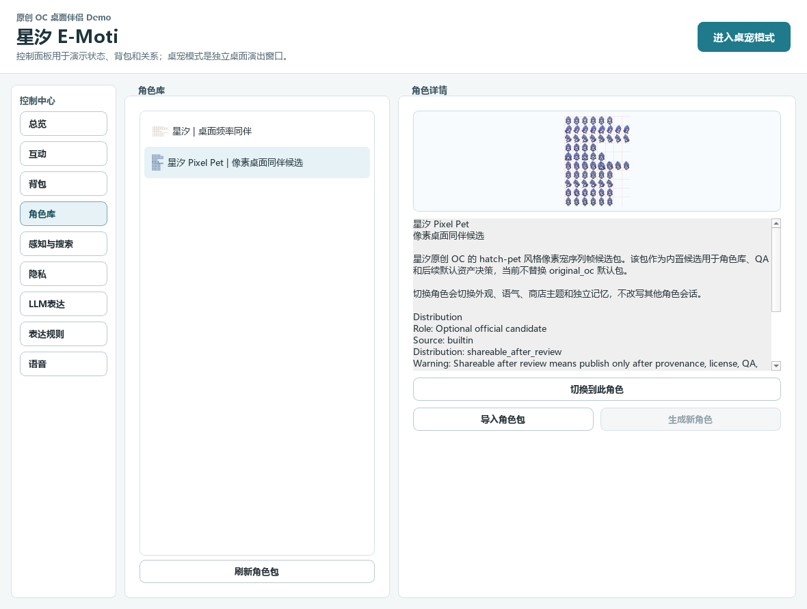
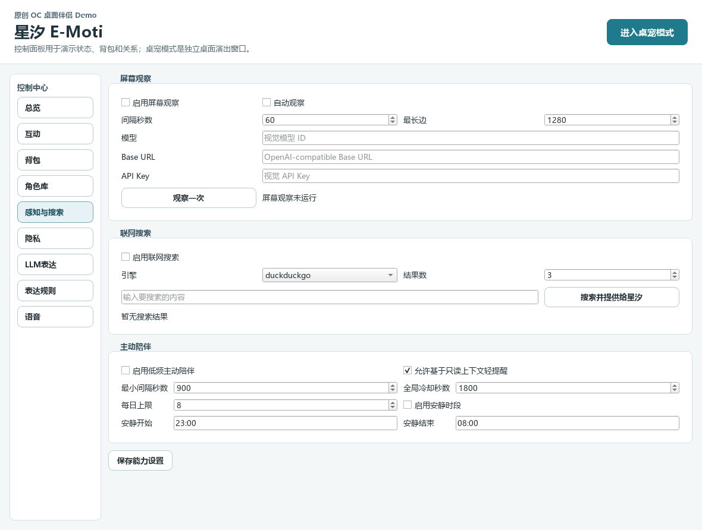
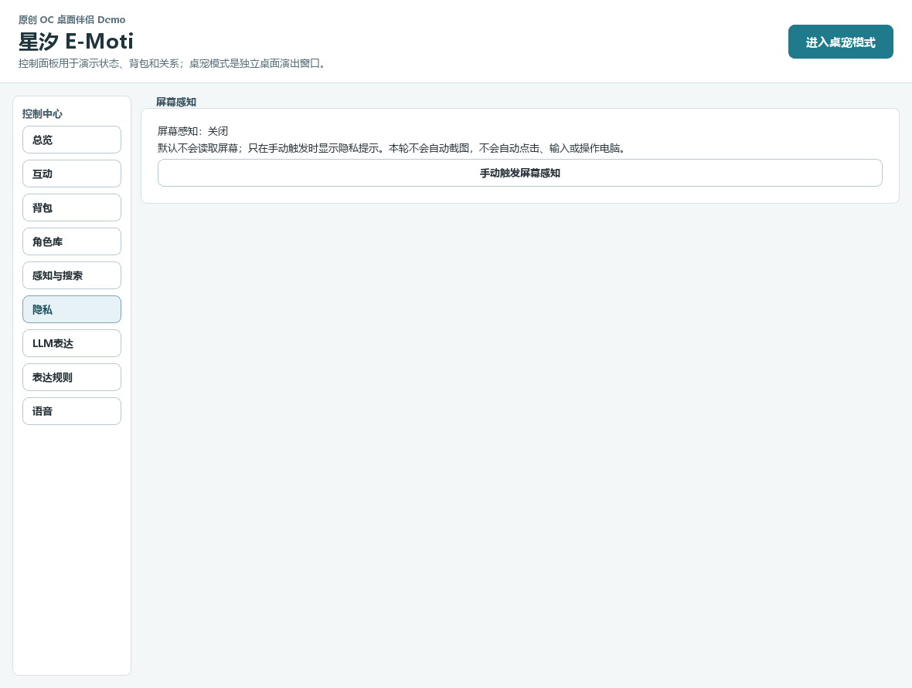
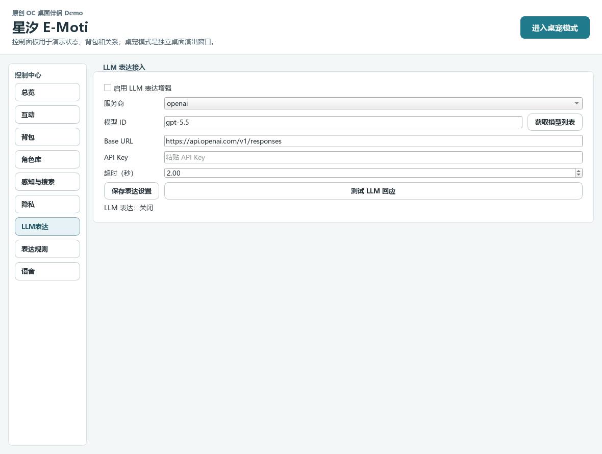
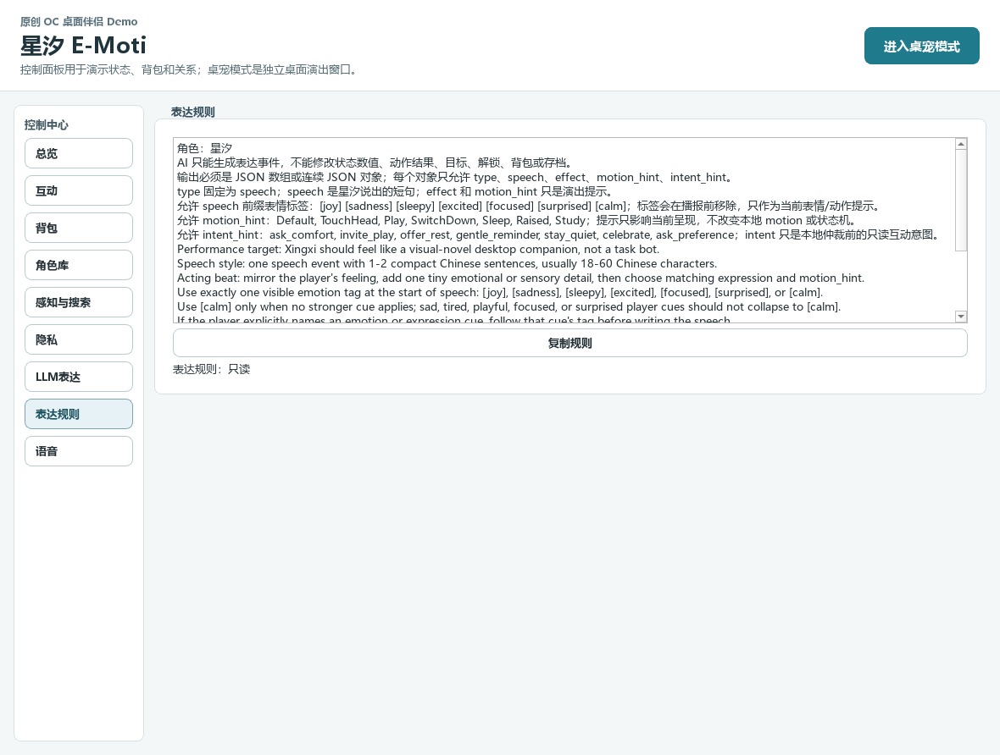
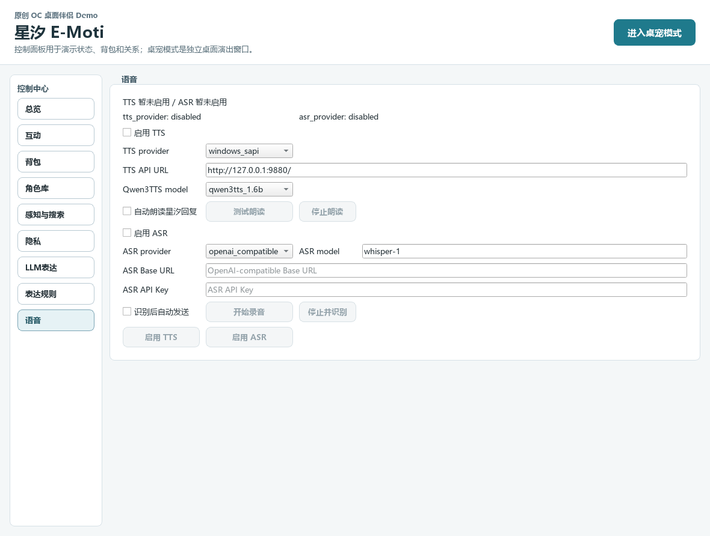

# E-Moti 星汐电子宠物最终交付验收文档

日期：2026-06-20，2026-06-21 更新
验收分支：`codex/p18-p23-implementation`  
验收工作包：像素星汐默认推广、角色详情 profile CG、私有 UGC 预览包
交付目标：面向课程导师展示一个可运行、可游玩、可解释、可复现的 Windows 桌面 AI 电子宠物 demo。

## 交付产物

| 产物 | 路径 | 用途 |
| --- | --- | --- |
| 免安装应用目录 | `dist\E-Moti\` | 直接运行冻结版应用。 |
| 冻结版 exe | `dist\E-Moti\E-Moti.exe` | 无需 Python 环境，双击即可启动控制面板。 |
| Windows 安装包 | `dist\installer\E-Moti_Setup_0.1.0.exe` | 推荐交付给导师的安装方式。 |
| 私有预览 zip | `dist\private-preview\E-Moti_Tutor_Private_Preview_20260621.zip` | 自带本机 DeepSeek 表达设置和私有 Ikaros/Nairong UGC 包，方便导师预览；不进入公开仓库。 |
| 验收截图 | `docs\assets\final-acceptance-20260620\` | 展示完整体验流程。 |
| 本地验收报告 | `artifacts\final-acceptance-20260621\` | 本机复核用 JSON/预览图，不进入仓库提交。 |

安装包未做代码签名，首次运行时 Windows SmartScreen 可能提示风险；这是本地课程 demo 的正常限制。

## 推荐演示流程

1. 运行安装包 `dist\installer\E-Moti_Setup_0.1.0.exe`，按默认选项安装。
2. 从开始菜单或桌面快捷方式启动 E-Moti。
3. 在控制面板查看星汐状态：心情、体力、饱食、关系、金币和当前动作。
4. 使用互动按钮进行轻触、安抚、休息、学习、玩耍等动作，观察状态和台词反馈。
5. 打开商店与背包，购买或使用食物、礼物、道具。
6. 打开角色库，查看默认像素星汐 `xingxi_pixel_pet`；私有预览包中还可查看本机 UGC 示例 Ikaros 与 Nairong，演示快速切换。
7. 打开感知、搜索、隐私、LLM 表达、表达规则、语音设置页，说明这些能力均为可配置增强能力。
8. 进入桌宠模式，观察透明置顶小人、对话气泡、缩小后的桌面尺寸、托盘隐藏/恢复和退出路径。
9. 如现场具备可用 API key，可演示一次 LLM 对话；否则使用本次 DeepSeek live smoke 结果说明 AI 表达链路已验证。

免安装备用方式：直接运行 `dist\E-Moti\E-Moti.exe`。桌宠模式可由控制面板进入，也可通过启动参数 `--pet-mode` 进入。

## 产品定位

E-Moti 是原创 OC 桌面电子宠物与陪伴 demo。学习、专注、休息只是星汐的动作状态，不代表它是课程监督工具、效率工具或光核吉祥物。

AI 是表达层核心：LLM 可以生成星汐台词、表情提示、动作提示和只读互动意图；但成长状态、金币、背包、关系、回忆、目标和存档仍由本地状态机管理。这样既能表现 AI 陪伴感，又能避免模型直接接管玩法状态。

## 功能总览

| 模块 | 当前能力 | 验收结论 |
| --- | --- | --- |
| 控制面板 | 状态、动作、商店、背包、关系、记忆、目标、设置和角色库入口 | 可演示 |
| 桌宠模式 | 透明置顶窗口、缩小后的 sprite 显示、对话气泡、右键菜单、托盘配合 | 可演示 |
| 养成状态 | 本地确定性结算，支持饱食、体力、心情、关系、金币等 | 可游玩 |
| 商店背包 | 商品 JSON 校验通过，购买、使用、赠送入口完整 | 可演示 |
| 多角色 | 支持内置角色与本机 UGC 角色切换，角色资产、元数据、存档命名空间分离 | 可演示 |
| 默认像素宠物 | `xingxi_pixel_pet` 已通过 pack 与视觉 QA，并作为默认可见角色 | 可演示 |
| 角色详情预览 | 角色库详情优先展示 `preview/profile.png` 角色 CG，而不是完整像素帧 contact sheet | 可演示 |
| LLM 表达 | DeepSeek live smoke 通过，支持 speech/expression/motion/intent typed events | 可用 |
| 状态安全 | LLM live smoke 未发现状态字段被模型直接修改 | 通过 |
| 屏幕观察 | 只读表达上下文能力，默认由用户配置启用 | 可解释 |
| Web 搜索 | 只读表达上下文能力，默认由用户配置启用 | 可解释 |
| TTS/ASR | TTS 消费已验证 speech，ASR 只产生玩家输入并走 `DialogueRequest` | 可解释 |
| 隐私设置 | 明示本地/可选外部能力边界，不做后台监听和系统控制 | 可解释 |
| 打包交付 | PyInstaller 冻结应用和 Inno Setup 安装包均构建并验证 | 可交付 |

## 体验截图

### 控制面板总览



### 互动与动作入口



### 商店与背包



### 角色库：星汐像素候选



### 角色切换后的控制面板


### 屏幕观察与搜索设置



### 隐私设置



### LLM 表达设置



### 表达规则



### 语音设置



### 桌宠模式


## AI 表达验收

本轮使用 DeepSeek live 调用验证，不在文档或仓库中记录 API key。

| 验收项 | 结果 |
| --- | --- |
| LLM dialogue smoke | `ok=true`，私有预览包单轮 live connectivity 通过 |
| fallback 次数 | `0` |
| expression 覆盖 | `focused` |
| motion 覆盖 | `Study` |
| speech 质量违规 | `0` |
| 状态突变检查 | `ok=true`，`changed_fields=[]` |
| readiness 聚合 | `ok=true`，`ready_check_count=5`，`attention_check_count=0` |

结论：当前 demo 的 LLM 表达链路可用，模型输出能进入 typed speech/expression/motion 事件；状态机没有被 live LLM 调用直接接管。

## 构建与验收记录

| 命令 | 结果 |
| --- | --- |
| `python -m pytest` | `891 passed in 225.04s` |
| `python -m json.tool assets\companion\original_oc\shop_items.json` | JSON 有效 |
| `python tools\character_library_qa.py --character-id xingxi_pixel_pet ...` | `character library QA ok` |
| `python tools\character_library_qa.py --character-id ikaros_ugc_pixel_pet --character-root data\character_packs ...` | `character library QA ok` |
| `python tools\character_library_qa.py --character-id nairong_ugc_pixel_pet --character-root data\character_packs ...` | `character library QA ok` |
| `python tools\desktop_pet_smoke.py --seconds 5 --interval 0.25` | `desktop pet smoke ok` |
| `python tools\validate_pixel_pet_pack.py assets\companion\xingxi_pixel_pet ...` | `ok=true`，边界为 `official_candidate` |
| `python tools\art\pixel_pet_visual_qa.py ... --fail-on-warnings` | `ok=true`，`status=ready`，无 warnings/errors |
| `python tools\llm_dialogue_smoke.py --provider deepseek ...` | `ok=true`，使用私有预览包设置 |
| `powershell -ExecutionPolicy Bypass -File tools\build_windows_app.ps1` | 构建 `dist\E-Moti\E-Moti.exe` 成功 |
| `powershell -ExecutionPolicy Bypass -File tools\build_windows_installer.ps1 -SkipAppBuild` | 构建 `dist\installer\E-Moti_Setup_0.1.0.exe` 成功 |
| `python tools\validate_windows_build.py --report artifacts\final-acceptance-20260621\windows-build-validation-default-xingxi.json` | `ok=true`，默认冻结角色为 `xingxi_pixel_pet` |
| 私有预览 zip 结构校验 | `3127` entries，关键入口和 UGC 包存在 |
| 私有预览角色库枚举 | `xingxi_pixel_pet`、`ikaros_ugc_pixel_pet`、`nairong_ugc_pixel_pet`，均使用 `profile.png` |
| 冻结版控制面板 5 秒 smoke | `ok` |
| 冻结版 `--pet-mode` 5 秒 smoke | `ok` |

构建产物大小：

- `dist\E-Moti\E-Moti.exe`：`5,729,110` bytes。
- `dist\installer\E-Moti_Setup_0.1.0.exe`：`184,520,987` bytes。
- `dist\private-preview\E-Moti_Tutor_Private_Preview_20260621.zip`：`269,749,180` bytes。

## 可复现命令

在仓库根目录运行：

```powershell
python -m pytest
python -m json.tool assets\companion\original_oc\shop_items.json
python tools\desktop_pet_smoke.py --seconds 5 --interval 0.25
python tools\validate_pixel_pet_pack.py assets\companion\xingxi_pixel_pet --report artifacts\final-acceptance-20260621\xingxi-pixel-pack-validation.json
python tools\art\pixel_pet_visual_qa.py assets\companion\xingxi_pixel_pet\spritesheet.png --motion-manifest assets\companion\xingxi_pixel_pet\motion_manifest.json --report artifacts\final-acceptance-20260621\xingxi-pixel-visual-qa.json --preview artifacts\final-acceptance-20260621\xingxi-pixel-visual-qa-preview.png --fail-on-warnings
python tools\character_library_qa.py --character-id xingxi_pixel_pet --report artifacts\character-library-qa\default-xingxi-profile-qa.json --screenshot-dir artifacts\character-library-qa\default-xingxi-profile-screenshots --pet-seconds 0.5
powershell -ExecutionPolicy Bypass -File tools\build_windows_app.ps1
powershell -ExecutionPolicy Bypass -File tools\build_windows_installer.ps1 -SkipAppBuild
python tools\validate_windows_build.py --report artifacts\final-acceptance-20260621\windows-build-validation-default-xingxi.json
```

DeepSeek live 验证需要先在当前 PowerShell 会话设置 provider key，再运行：

```powershell
python tools\llm_dialogue_smoke.py --provider deepseek --timeout-seconds 45 --prompt "导师预览包 live LLM 自检：请用一句中文回应，并给出一个表情和一个动作提示。" --min-expression-actions 1 --min-motion-actions 1 --min-speech-chars 1 --max-speech-chars 80 --report artifacts\final-acceptance-20260621\private-preview-deepseek-single-prompt-connectivity.json
```

不要把 provider key 写入仓库、文档或提交记录。

## 权利与分发边界

- 默认可交付角色是 `xingxi_pixel_pet`。
- `original_oc` 仅作为隐藏兼容 fallback 保留，不再作为角色库里的主展示角色。
- Ikaros、Nairong 等第三方或粉丝向角色只能作为本机 UGC 工作流代表；未获授权前不能随开源仓库公开分发。私有预览包可把它们放入本机 `character_packs` 目录用于切换流程 QA。
- Shinsekai、VPet、Live2D、AI-video 等方向只作为架构和路线参考，不复制源码、素材、prompt、角色设定或 UI 文案。

## 已知限制

- live AI 表达依赖用户配置的 provider、API key 与网络；无 key 时 demo 仍可作为本地电子宠物运行。
- 当前没有后台常驻监听、唤醒词、键鼠控制、剪贴板控制、窗口控制或开机自启。
- 屏幕观察与 Web 搜索默认是只读表达上下文增强，不修改养成状态。
- 公开仓库只分发原创 Xingxi 资产；Ikaros、Nairong 仅用于私有本机预览和 UGC 流程验证。
- 安装包未签名，不适合直接面向大众发布；课程交付和导师本机演示可以使用。

## 交付结论

截至本次验收，E-Moti 可以正常运行、正常游玩，并具备课程课题所需的完整 demo 闭环：

- 有原创桌面电子宠物形象与可解释的养成状态机；
- 有控制面板、桌宠模式、托盘友好体验、商店背包、角色库和多角色切换能力；
- 有以 LLM 为核心的表达增强链路，并通过 typed events 与状态守卫限制模型权限；
- 有截图、测试、live LLM、桌宠 smoke、冻结 exe、安装包和构建验证证据。

后续优化应继续围绕像素宠物序列帧质量、多角色 UGC 导入体验、LLM 表演质量、语音体验和签名发布流程推进，不建议在交付前再引入 Live2D、AI-video 或系统级后台能力。
