# E-Moti：我想让一只桌宠，真的记得和你一起生活过

> **关于轻量养成、情感记忆与主动陪伴的一次独立开发实践**

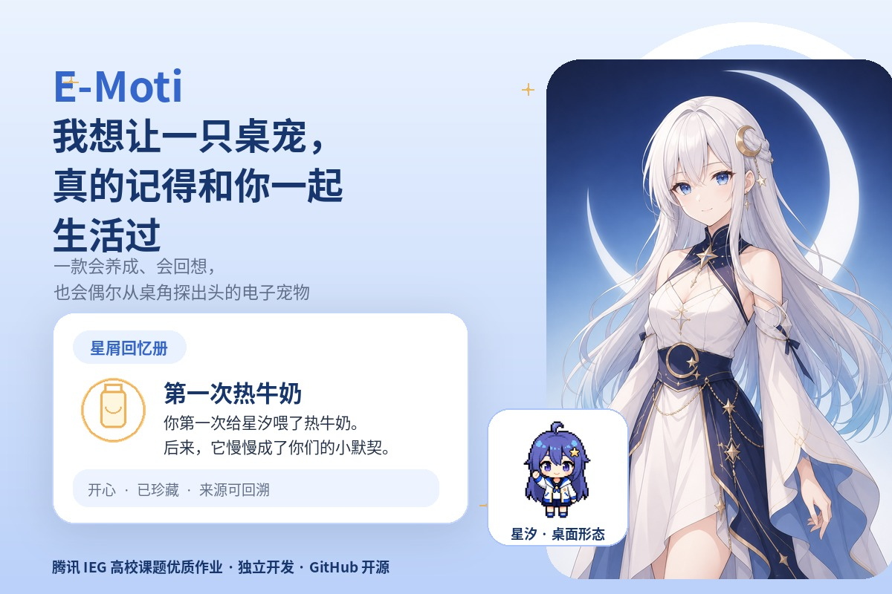

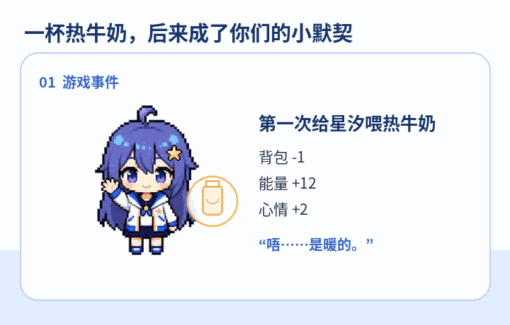

*图：星汐现有像素资源与情感记忆原型。星屑回忆册现已接入正式 PySide6 客户端。*

我在调试投喂逻辑时，拿“热牛奶”连续测了好几轮。

背包少一，能量增加 12，心情增加 2，动作也切到了投喂状态。测试结果全绿，我准备收工，关掉程序前又看了一眼桌面上的星汐。

第二天重新打开，她对昨晚那杯奶没有任何印象。

代码跑通了，这段互动却只活了几秒。玩家昨天做过什么，今天再点一次按钮，游戏给出的反馈几乎一样。

这件小事拉着我重做了 E-Moti 的记忆层。

E-Moti 是我独立完成的一款 Windows 桌面电子宠物。项目最初来自腾讯 IEG 高校课题，课题名是《赛博宠物游戏研发设计》，作品获评优质作业。课程版本已经做出桌面常驻、轻量养成、商店背包、角色切换和可选 AI 表达。之后，我把代码、角色包、测试和开发文档整理到 GitHub 开源，继续补完当时来不及展开的部分。

我一直把它当成一款电子宠物游戏。摸头、玩耍、共同学习、送礼、休息和关系解锁构成日常玩法；AI 留在角色表演层，帮星汐把同一件事说得更像她自己。

**AI 使用：** ChatGPT、Codex、DeepSeek、视觉模型和图像生成工具参与资料检索、编码辅助、测试补充、素材候选和文档复审；玩法、记忆规则、角色边界、公开素材和最终验收由我逐项确认。

---

## 一、先把星汐养起来

E-Moti 的主循环很轻。玩家在桌面上陪星汐待一会儿，做几个互动，赚一点金币，再去商店买食物或礼物。她的状态会跟着这些选择变化。

星汐有专注、能量、稳定、心情和信任，也有等级、背包与关系目标。每次互动都由本地规则结算：

- 共同学习消耗专注和能量，增加经验、金币与信任；
- 玩耍能拉高心情，能量见底时她会拒绝继续；
- 同一件礼物短时间反复赠送，关系收益逐步下降；
- 稳定度过低时，她进入保护状态，只接受安抚或休息；
- 信任达到阶段门槛后，新的称呼、装饰和共同日常解锁。

这些规则给角色留出了脾气和节奏。玩家能看见自己照顾她之后发生的变化，也会遇到“现在不想玩”的回应。

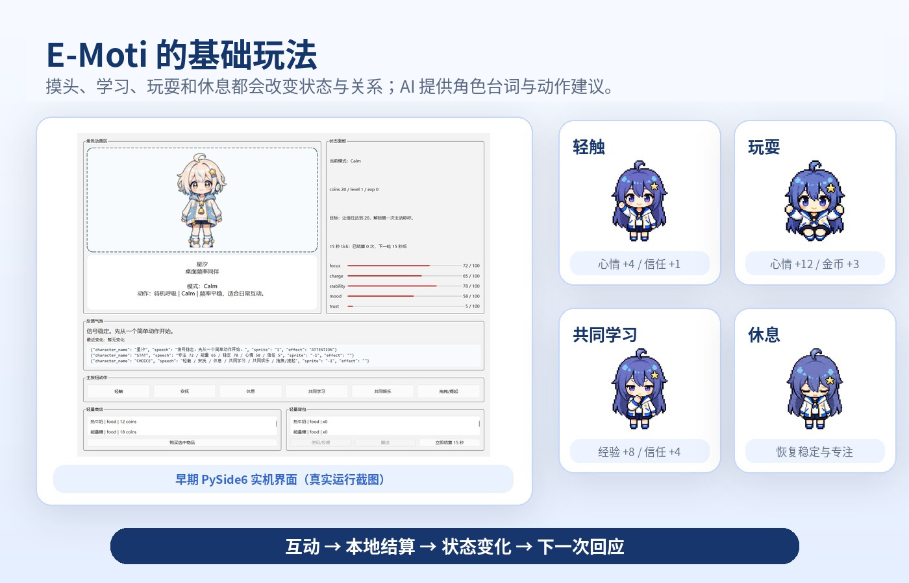

*图：左侧为课程阶段的 PySide6 运行界面，右侧为现行星汐像素角色包中的动作帧。两套视觉资产仍在统一。*

这些状态都保存在本地。断网时，星汐照样能吃饭、休息、涨信任、保存背包。大模型服务掉线，养成进度不会跟着消失。

---

## 二、热牛奶暴露了记忆层的问题

课程版本已经保存三类记录。近期互动日志方便回看刚刚发生的事；本地对话历史维持几轮交流的连贯；长期区保存少量称呼和关系里程碑。

课程版能把数据留在本地，筛选和召回仍然粗糙。第一次热牛奶和第十次热牛奶会长得很像，一段一个月前的纪念经历也可能被昨天的普通操作挤到后面。

我把记忆写入放在本地结算之后。游戏先确认投喂确实发生，再由记忆规则判断这次事件的分量。

第一次给星汐喝热牛奶，会生成一张《第一次热牛奶》。后续普通投喂留在近期日志，不重复占用长期回忆。聊到饮品、休息或那段共同日常时，召回器再把这张卡找出来。

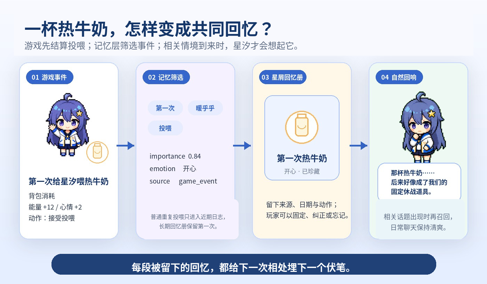

*图：游戏事件经过筛选进入纪念回忆；相关话题出现时，星汐才会想起它。*

星汐提起那杯奶时，系统能追到具体道具、时间和事件来源。玩家也能固定、纠正或删除这段回忆。模型负责把句子说顺，过去发生过什么由本地记录说了算。

一杯热牛奶在当天提供 12 点能量。过了一段时间，它也许会成为两个人习惯在忙完后短暂停一会儿的开端。

---

## 三、记忆在程序里怎么走

我把当前方案分成四层。

### 游戏事实

信任、金币、背包、关系阶段、称呼、解锁和存档都放在本地状态里。这些数据决定养成结果，模型只有读取权限。

### 相处瞬间

第一次投喂、第一次共同学习、关系解锁、久别重逢，以及玩家明确要求记住的内容，会生成带时间和来源的候选事件。普通摸头和重复投喂继续留在近期日志。

### 纪念与羁绊

称呼、关系阶段、明确边界和共同仪式属于常驻信息。其余回忆按当前话题、时间、重要性、情绪强度和关系进展进行排序。

### 关系章节

若干重要事件可以整理成《我们的第一份小默契》《被好好收下的小心意》一类章节。每一章都保留来源记忆 ID，后续文案润色只能使用这些事实。

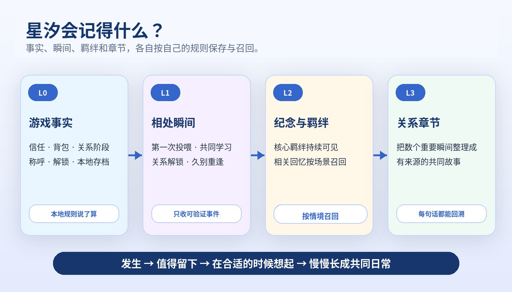

*图：游戏事实、相处瞬间、纪念羁绊和关系章节各有自己的保存与召回规则。*

记忆数量需要控制。普通互动写得太多，纪念卡很快失去分量；召回时机选错，角色也会像在硬翻旧账。当前策略偏保守：长期区少记，相关性不足时保持沉默。

屏幕摘要只参与当下判断。窗口正文、代码内容和原始截图不会自动进入长期记忆。玩家确认并完成的一次共同事件，才有机会被留下。

---

## 四、我把记忆做成了“星屑回忆册”

玩家很难从 JSON 文件或模型上下文里感受到陪伴。回忆需要出现在游戏界面中。

“星屑回忆册”按相处内容分类：

- **第一次**：第一次投喂、第一次共同学习、第一次称呼；
- **小默契**：逐渐形成的共同仪式和关系里程碑；
- **礼物与纪念**：有特殊意义的道具与装饰；
- **共同日常**：一起学习、玩耍和休息的片段；
- **关于你**：玩家明确希望星汐记住的偏好与边界；
- **关系章节**：由若干真实事件组成的一段共同经历。

一张卡片会显示标题、时间、情绪、来源和珍藏状态。玩家可以固定、纠正、忘记，也可以打开来源，看看这段回忆从哪里来。

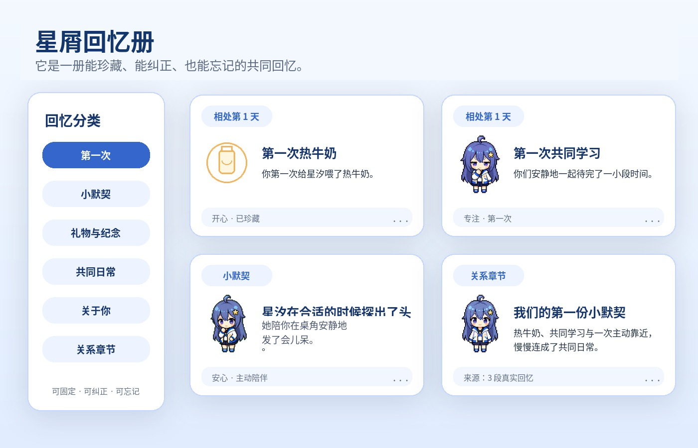

*图：回忆册的分类、卡片字段和操作语义已经进入正式 PySide6 页面。*

回忆会进入养成循环。纪念卡能够解锁桌面摆件、微动作、称呼和专属台词；重复出现的行为会慢慢长成共同仪式。热牛奶从一件补充能量的道具，变成桌面上的固定小习惯。

---

## 五、模型写台词，存档由本地规则管理

E-Moti 的金币、背包、信任、关系阶段、事件来源和存档都由本地系统维护。

模型收到角色设定、当前状态、最近对话和被召回的记忆，返回一组受限制的表达事件：台词、表情、动作提示，以及靠近、安慰、邀请玩耍、保持安静等轻量意图。事件通过校验后才会交给桌宠执行。

这个分工让我敢于把星汐的语气写得更活一些。她偶尔卖萌、害羞或吐槽，临场台词也碰不到金币和信任值。存档不会因为一句生成结果跑偏。

---

## 六、52 分钟后，她从桌角探了出来

我给 E-Moti 补了一条低频主动陪伴链路，项目里叫“探头时刻”。

用户开启后，程序读取前台应用的粗分类和系统闲置时长。它会累计连续专注时间，再检查安静时段、冷却、每日上限、星汐状态和最近一次拒绝。

计时器很快就能写完，时机判断花了更多时间。角色一天探头十次，只会变成新的弹窗；玩家刚说过“今天先别管我”，她也应该安静下来。

满足条件时，星汐切换到有些困惑的动作，问一句：

> “欸，你和这段代码已经对峙 52 分钟了……要不要陪我发五分钟呆？我帮你看着时间。”

这句属于游戏内角色文案，所以保留轻微的二次元口癖。玩家可以陪她歇一会儿、稍后再说，或者让她今天不再出现。拒绝会触发更长的冷却。

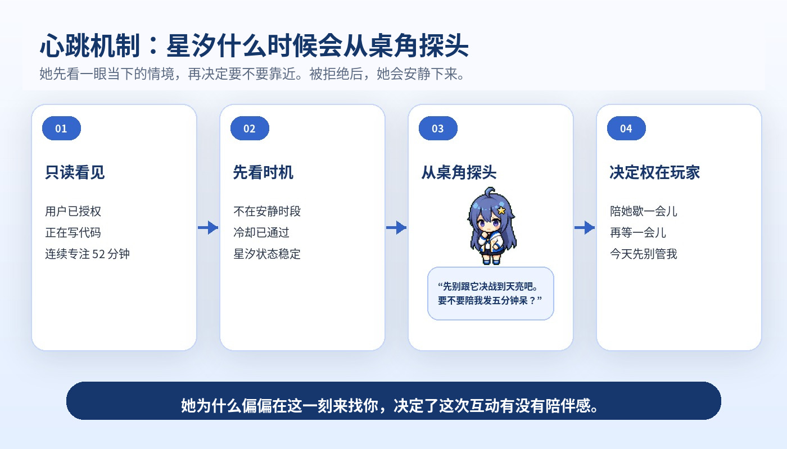

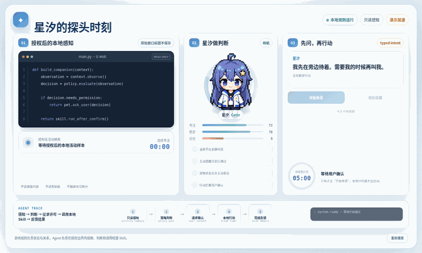

*图：只读观察、时机判断、角色询问、玩家确认和本地轻量动作。*

玩家确认并完成休息后，系统会记录一次共同事件：

> 你和星汐在桌角安静地停了五分钟。

原始屏幕内容不会跟着写入。留下来的只有双方共同完成的结果。

---

## 七、角色卡和像素小人的取舍

项目早期试过半身立绘和 AI 视频方案，也试过 LivePortrait 与 Live2D。每条路线都做过小规模验证，实际成本包括帧间漂移、透明边缘、模型绑定、制作周期和授权。

课程版本最后采用“角色卡 CG + 像素桌宠序列帧”。角色卡展示完整人设，像素形态负责桌面小窗口里的动作。小尺寸下的轮廓更清楚，序列帧也方便检查和打包。

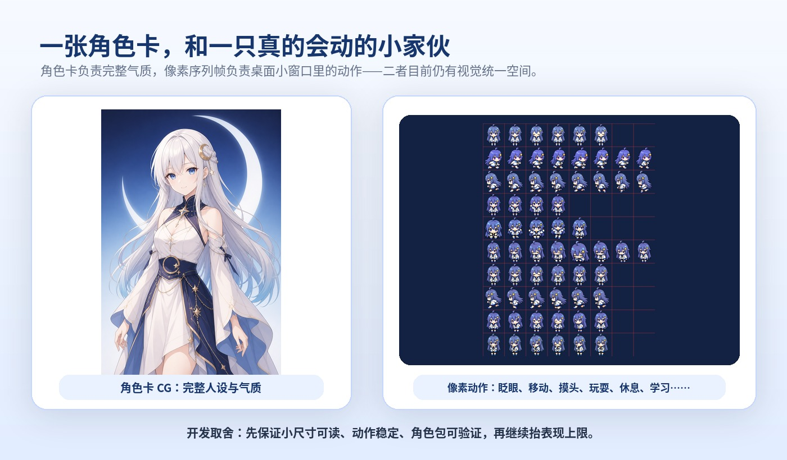

*图：左侧为星汐角色卡，右侧为现行像素动作 Contact Sheet。发色、配饰和服装细节仍有几处需要统一。*

这条路线的表现上限没有 Live2D 高，交付稳定性更适合当前阶段。先让星汐在桌面上稳定地呼吸、眨眼、吃东西和睡觉，再逐步抬高美术规格。

---

## 八、我给 E-Moti 留了一扇门

做完热牛奶记忆和回忆册之后，我开始考虑另一个问题：以后再加一个小游戏、一套语音服务，或者一种新的角色互动，是否每次都要改主控制器和主界面？

我保留了 Python、PySide6、本地状态机和现有角色包，在外面增加一层独立的 Plugin Runtime。插件可以注册玩家动作、角色 Skill、记忆规则、表达上下文和通用页面；LLM、TTS、ASR、屏幕摘要与搜索也通过统一能力接口接入。

第一个内置例子叫“星图角落”。启用后，互动区会出现“一起看星星”。第一次完成这项互动，回忆册会留下《第一次一起看星星》；第二次只更新累计次数；关闭插件后，动作和页面从界面中撤销，已经形成的共同回忆仍然保留。

插件读取的是游戏状态快照。金币、背包、关系和存档继续由本地规则结算。本地安装插件默认关闭，插件中心会展示来源、权限、依赖、静态审计和故障记录。同进程 Python 插件属于可信代码扩展，第三方插件仍需玩家确认来源后再启用。

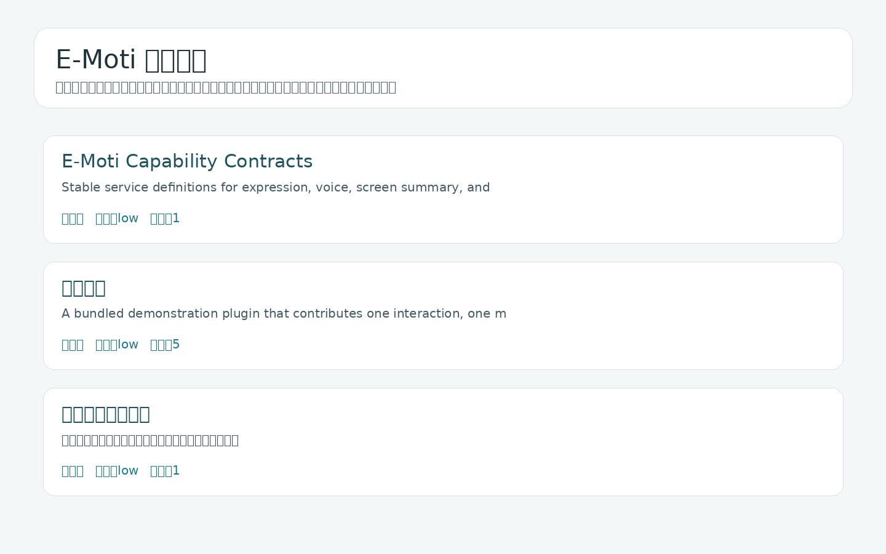

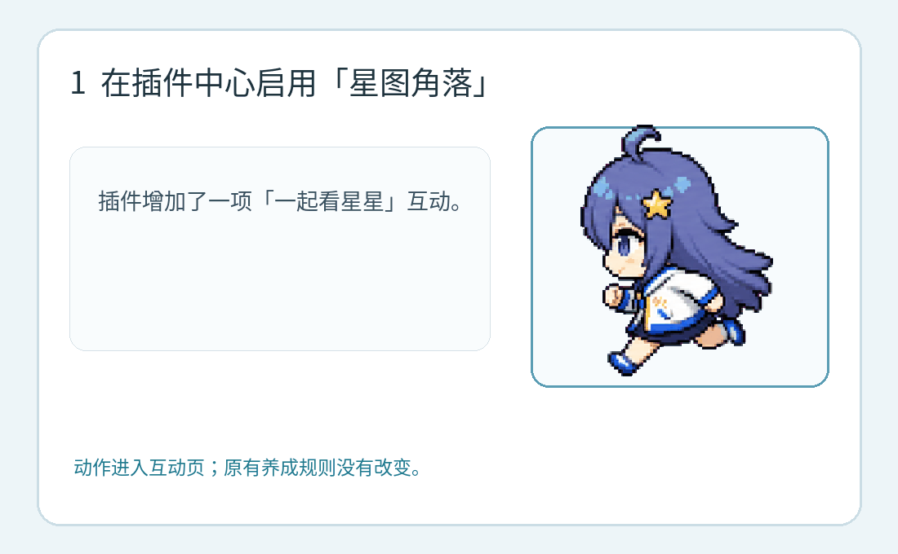

*图：插件中心与“星图角落”的启用、互动、记忆生成和撤销流程。*

---

## 九、这轮在 Windows 上跑了什么

我把情感记忆、探头时刻、插件运行时、插件中心和正式回忆册接入完整仓库，使用冻结后的 Windows 客户端做了实机验收。

最终全量测试为 1185 项，插件与故事链聚焦测试为 327 项。端到端流程也跑了一遍：

- 第一次热牛奶生成纪念回忆；
- 普通重复投喂不再刷长期记录；
- 相关话题能召回《第一次热牛奶》；
- 无关话题不会插入这段旧事；
- 关系章节保留来源，重复整理不会反复生成同名内容；
- 探头时刻完成后形成共同事件；
- “星图角落”启停时动作与页面能够动态出现和撤销；
- 金币、背包和信任等成长状态保持不变；
- 星汐的游戏内台词与公众号作者正文分别使用两套文案规则。

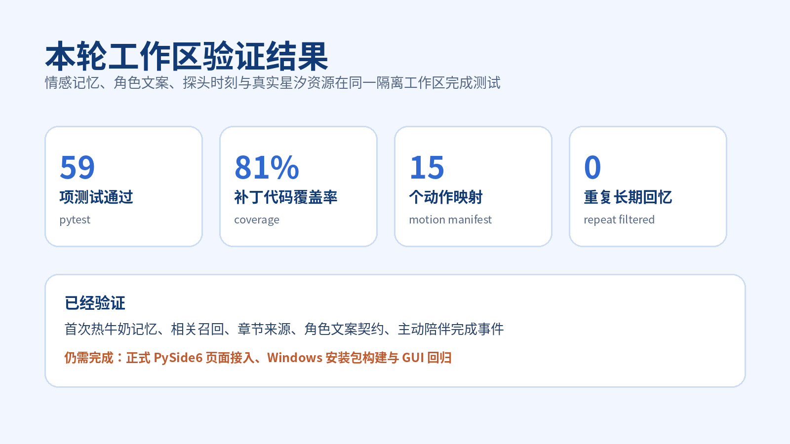

*图：情感记忆、主动陪伴和插件生命周期已经完成逻辑验证与 Windows 实机回归。*

Windows 便携版和安装器均已重新构建。冻结客户端实测了角色切换、桌宠对话、回忆来源、探头时刻、插件启停、托盘隐藏与恢复、桌宠右键退出。外部服务关闭时，基础养成与本地表达仍可继续运行。

---

## 十、接下来

- **给共同经历补上游戏奖励。** 关系章节会解锁纪念卡面、桌面摆件、动作和称呼；反复发生的行为会沉淀成日常仪式。
- **继续调整主动性和美术表现。** 探头频率、旧回忆引用、眨眼、困惑、害羞和睡眠动作都需要实机打磨。
- **提高外部能力的一键可用性。** 继续收紧视觉模型鉴权、语音服务部署和失败提示，让增强能力更容易配置和诊断。

我期待的最终画面很简单：玩家隔了一段时间再打开 E-Moti，桌角的小家伙先做出一个熟悉的动作，随后提起他们曾经一起做过的一件小事。

她记住的内容不多，玩家随时能查看和删除。那一刻仍然足够让人感到，这只宠物确实陪自己生活过一段时间。

---

**项目信息：** E-Moti｜独立开发｜Windows 10 / 11｜Python、PySide6、本地状态机、情感记忆层、Typed Events、TTS / ASR、角色包与自动化 QA｜GitHub：`https://github.com/shenbo1264/E-Moti`
